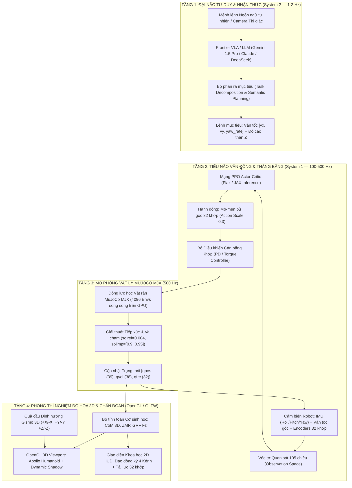
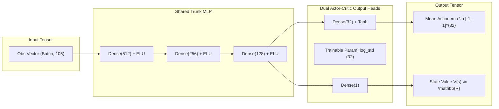
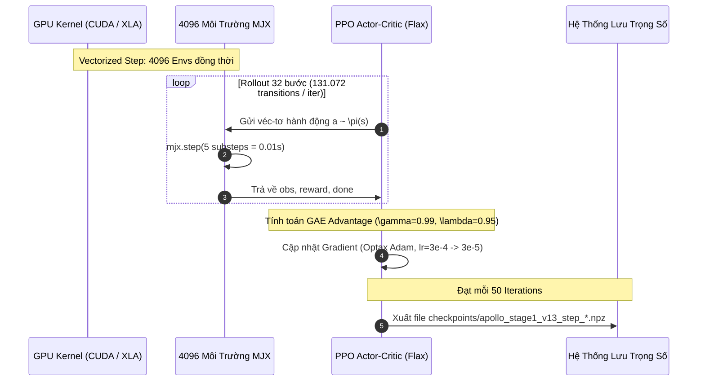

# 🤖 Apptronik Apollo Humanoid — Biomechanics Telemetry & MJX Deep Reinforcement Learning Suite

[](https://www.python.org/)
[](https://mujoco.org/)
[](https://github.com/google-deepmind/mujoco)
[](https://github.com/google/flax)
[-20BEFF?logo=kaggle&logoColor=white)](https://www.kaggle.com/)
[](https://colab.research.google.com/)
[](#)
[](LICENSE)

---

## 📌 1. Giới Thiệu & Mục Tiêu Nghiên Cứu (Mission & Scope)

Dự án **`medical-science`** là nền tảng nghiên cứu chuyên sâu về **Cơ sinh học Robot Hình người (Humanoid Biomechanics)**, **Điều khiển Vận động Toàn thân (Whole-Body Locomotion)** và **Học tăng cường sâu gia tốc phần cứng trên GPU (GPU-Accelerated Deep Reinforcement Learning)**.

Nền tảng tập trung vào mẫu robot hình người công nghiệp thế hệ mới **Apptronik Apollo** từ bộ thư viện mô hình chuẩn của **Google DeepMind Menagerie**, tích hợp song song cùng các tài nguyên mô phỏng robot phẫu thuật y sinh (**da Vinci Research Kit / dVRK**).

### 🎯 Các Trụ Cột Kỹ Thuật Trọng Tâm:
1. **Mô phỏng Động học & Động lực học Cấp cao:** Tái hiện chính xác tương tác tiếp xúc phi tuyến (Non-linear Rigid Body Contacts) của 32 bậc tự do với khối lượng toàn thân **80.898 kg**, mô-men xoắn cực đại lên tới **494 Nm** trên mỗi khớp háng.
2. **Học tăng cường Vector hóa trên GPU (MuJoCo MJX + JAX):** Huấn luyện đồng thời **4.096 môi trường vật lý song song** trực tiếp trên VRAM của GPU, đạt thông lượng vượt trội **540.000+ bước/giây (SPS)**.
3. **Phòng Thí Nghiệm Đo Lường Cơ Sinh Học Thời Gian Thực (3D Telemetry Studio):** Tích hợp công cụ giám sát trực quan các véc-tơ Trọng tâm (CoM), Lực phản lực mặt đất (GRF), Điểm Zero Moment Point (ZMP) và Đa giác thăng bằng (Support Polygon) hoàn toàn bằng tiếng Việt chuẩn xác.
4. **Hệ thống Triển khai Đám mây Kép Tự động (Dual-Cloud Automation):** Đóng gói quy trình huấn luyện 1-dòng lệnh cho cả cụm máy chủ **Kaggle Dual NVIDIA T4** và **Google Colab GPU**, hỗ trợ cơ chế phục hồi trọng số (Auto-Resume Checkpoints) không gián đoạn.

---

## 🏛️ 2. Sơ Đồ Kiến Trúc Hệ Thống Tổng Thể (System Architecture)



---

## 📊 3. Thông Số Kỹ Thuật Phần Cứng Robot Apollo (Hardware Specifications)

Dữ liệu hình học và động lực học trích xuất trực tiếp từ mô hình [`scene.xml`](file:///d:/GitHub/medical-science/google_deepmind_menagerie/apptronik_apollo/scene.xml):

| Đại lượng Vật lý | Giá trị Định lượng | Đơn vị | Ghi chú Kỹ thuật |
| :--- | :---: | :---: | :--- |
| **Tổng khối lượng cơ thể ($M_{total}$)** | **80.898** | $kg$ | Bao gồm khung hợp kim, 32 động cơ servo và cụm pin thân |
| **Chiều cao danh định ($H_{total}$)** | **1.730** | $m$ | Chiều cao thẳng đứng từ mặt sàn đến đỉnh đầu |
| **Độ cao khung chậu đứng chuẩn ($Z_{nominal}$)** | **1.0160** | $m$ | Chiều cao gốc khung hông (`pelvis`) ở tư thế đứng thăng bằng |
| **Số bậc tự do cấu hình ($n_q$)** | **39** | — | 7 tọa độ gốc tự do (3 vị trí + 4 quaternion) + 32 khớp xoay |
| **Số bậc tự do vận tốc ($n_v$)** | **38** | — | 6 vận tốc không gian gốc (3 tịnh tiến + 3 góc) + 32 vận tốc khớp |
| **Tổng số Actuator điều khiển ($n_u$)** | **32** | — | 32 động cơ mô-men xoắn độc lập điều khiển toàn thân |
| **Tổng số phân đoạn thân ($n_{body}$)** | **37** | — | Khung thân, cụm cổ, 2 cánh tay và 2 chi dưới |
| **Tổng số hình học va chạm ($n_{geom}$)** | **80** | — | Gồm các khối vỏ bao bọc va chạm và mắt lưới thẩm mỹ |
| **Tần số vòng lặp vật lý ($f_{sim}$)** | **500** | $Hz$ | Bước tích phân thời gian $\Delta t_{sim} = 0.002$ giây |
| **Tần số vòng lặp điều khiển ($f_{ctrl}$)** | **100** | $Hz$ | Bước điều khiển $\Delta t_{ctrl} = 0.010$ giây ($n_{substeps} = 5$) |

### 🦾 Phân Bố & Giới Hạn Tải Lực 32 Khớp Động Học (Actuator Registry):

```
                                [ ĐẦU & CỔ (3 DoF) ]
                           neck_pitch  [-0.26, 0.52] rad | ±34.2 Nm
                           neck_roll   [-0.79, 0.79] rad | ±34.2 Nm
                           neck_yaw    [-1.66, 1.66] rad | ±10.6 Nm
                                         │
               ┌─────────────────────────┴─────────────────────────┐
    [ TAY TRÁI (7 DoF) ]                                  [ TAY PHẢI (7 DoF) ]
l_shoulder_fe  [-2.18, 0.61] | ±114 Nm                 r_shoulder_fe  [-2.18, 0.61] | ±114 Nm
l_shoulder_aa  [-0.12, 1.61] | ±78.0 Nm                r_shoulder_aa  [-1.61, 0.12] | ±78.0 Nm
l_shoulder_ie  [-0.47, 0.47] | ±67.0 Nm                r_shoulder_ie  [-0.47, 0.47] | ±67.0 Nm
l_elbow_fe     [-2.62, 0.17] | ±114 Nm                 r_elbow_fe     [-2.62, 0.17] | ±114 Nm
l_wrist_roll   [-1.66, 1.66] | ±10.6 Nm                r_wrist_roll   [-1.66, 1.66] | ±10.6 Nm
l_wrist_yaw    [-0.79, 0.79] | ±34.2 Nm                r_wrist_yaw    [-0.79, 0.79] | ±34.2 Nm
l_wrist_pitch  [-0.84, 1.68] | ±34.2 Nm                r_wrist_pitch  [-1.68, 0.84] | ±34.2 Nm
               │                                                   │
               └─────────────────────────┬─────────────────────────┘
                                  [ KHUNG THÂN (3 DoF) ]
                           torso_pitch [-0.31, 1.35] rad | ±315.0 Nm
                           torso_roll  [-0.21, 0.21] rad | ±414.0 Nm  <-- Khớp chống lật thân
                           torso_yaw   [-0.83, 0.83] rad | ±120.0 Nm
                                         │
               ┌─────────────────────────┴─────────────────────────┐
    [ CHÂN TRÁI (6 DoF) ]                                 [ CHÂN PHẢI (6 DoF) ]
l_hip_aa       [-0.22, 0.74] | ±494.0 Nm  <-- MAX TORQUE --> r_hip_aa       [-0.74, 0.22] | ±494.0 Nm
l_hip_fe       [-1.85, 0.48] | ±342.0 Nm                 r_hip_fe       [-1.85, 0.48] | ±342.0 Nm
l_hip_ie       [-0.57, 1.09] | ±120.0 Nm                 r_hip_ie       [-1.09, 0.57] | ±120.0 Nm
l_knee_fe      [ 0.00, 2.62] | ±336.0 Nm                 r_knee_fe      [ 0.00, 2.62] | ±336.0 Nm
l_ankle_pd     [-1.57, 0.44] | ±150.0 Nm                 r_ankle_pd     [-1.57, 0.44] | ±150.0 Nm
l_ankle_ie     [-0.65, 0.31] | ±120.0 Nm                 r_ankle_ie     [-0.31, 0.65] | ±120.0 Nm
```

---

## 🔬 4. Không Gian Quan Sát & Kiến Trúc Mạng Nơ-ron (Observation & Network Dataflow)

### 📐 Không Gian Quan Sát (Observation Vector — 105 Chiều):
$$\mathbf{O}_t = \left[ \mathbf{u}_z^{body}, \; \mathbf{v}_{base}, \; \boldsymbol{\omega}_{base}, \; (\mathbf{q}_{joint} - \mathbf{q}_{nominal}), \; \dot{\mathbf{q}}_{joint}, \; \mathbf{a}_{t-1} \right] \in \mathbb{R}^{105}$$

- $\mathbf{u}_z^{body} \in \mathbb{R}^3$: Véc-tơ chỉ phương trục $Z$ của thân robot trong hệ quy chiếu thế giới:
  $$\mathbf{u}_z^{body} = \begin{bmatrix} 2(q_x q_z + q_w q_y) \\ 2(q_y q_z - q_w q_x) \\ 1 - 2(q_x^2 + q_y^2) \end{bmatrix} \quad (\text{khi đứng thẳng tuyệt đối, } \mathbf{u}_z = [0, 0, 1]^T)$$
- $\mathbf{v}_{base} \in \mathbb{R}^3$: Vận tốc tịnh tiến khung chậu $[v_x, v_y, v_z]$.
- $\boldsymbol{\omega}_{base} \in \mathbb{R}^3$: Vận tốc góc khung chậu $[\omega_x, \omega_y, \omega_z]$.
- $\Delta \mathbf{q} \in \mathbb{R}^{32}$: Sai lệch góc quay 32 khớp so với thế đứng chuẩn $\mathbf{q}_{nominal}$.
- $\dot{\mathbf{q}} \in \mathbb{R}^{32}$: Vận tốc góc tức thời của 32 khớp.
- $\mathbf{a}_{t-1} \in \mathbb{R}^{32}$: Hành động chuẩn hóa ở bước thời gian liền trước.



---

## 🧮 5. Công Thức Toán Học Hàm Phần Thưởng (Reward Formulation)

Hàm phần thưởng được xây dựng theo chuẩn nghiên cứu cơ sinh học của Google DeepMind, cân bằng giữa mục tiêu giữ vững trọng tâm và tối ưu hóa năng lượng tiêu thụ:

$$\mathcal{R}_t = \Delta t \cdot \left[ r_{lin\_vel} + r_{ang\_vel} - c_{vz} - c_{\omega\_xy} - c_{orient} - c_{stand} - c_{torque} - c_{rate} - c_{limit} \right]$$

Chi tiết trọng số và ý nghĩa vật lý của từng thành phần:

| Thành phần | Trọng số ($w_i$) | Công thức toán học | Ý nghĩa Vật lý & Cơ sinh học |
| :--- | :---: | :--- | :--- |
| **Bám vận tốc ngang ($r_{lin\_vel}$)** | $+1.0$ | $\exp\left(-\frac{v_x^2 + v_y^2}{\sigma}\right)$ với $\sigma = 0.25$ | Khuyến khích đứng yên tại chỗ, triệt tiêu trôi dạt ngang |
| **Bám vận tốc xoay ($r_{ang\_vel}$)** | $+0.5$ | $\exp\left(-\frac{\omega_z^2}{\sigma}\right)$ | Ngăn ngừa hiện tượng xoay tròn quanh trục đứng (Yaw spin) |
| **Phạt vận tốc đứng ($c_{vz}$)** | $-2.0$ | $v_z^2$ | Dập tắt dao động nhún nhảy lên xuống của khung hông |
| **Phạt lật thân ($c_{\omega\_xy}$)** | $-0.05$ | $\omega_x^2 + \omega_y^2$ | Chống lắc lư lắc lư sang hai bên (Roll) và cúi ngửa (Pitch) |
| **Phạt nghiêng thân ($c_{orient}$)** | $-1.0$ | $(u_x^{body})^2 + (u_y^{body})^2$ | Bắt buộc véc-tơ thân trên luôn vuông góc với mặt đất |
| **Phạt lệch thế đứng ($c_{stand}$)** | $-0.5$ | $\sum_{i=1}^{32} \|q_i - q_i^{nominal}\|$ | Giữ các khớp chi trên và chi dưới gần vị trí cân bằng tối ưu |
| **Phạt mô-men xoắn ($c_{torque}$)** | $-10^{-4}$ | $\sqrt{\sum \tau_i^2} + \sum \|\tau_i\|$ | Giảm tải nhiệt cho động cơ servo, tiết kiệm năng lượng pin |
| **Phạt gia tốc giật ($c_{rate}$)** | $-0.01$ | $\sum_{i=1}^{32} (a_{i,t} - a_{i,t-1})^2$ | Mượt mà hóa tín hiệu điều khiển, chống rung lắc cơ khí |
| **Phạt giới hạn khớp ($c_{limit}$)** | $-10.0$ | $\sum \left( [q - q_{max}]_+ + [q_{min} - q]_+ \right)$ | Bảo vệ an toàn phần cứng, cấm khớp vượt hành trình |

### 🛑 Điều Kiện Dừng Episode (Termination Conditions):
Một episode huấn luyện lập tức dừng và chuyển sang trạng thái ngã nếu thỏa mãn một trong hai điều kiện:
1. **Rơi độ cao:** Chiều cao khung chậu $Z < 0.75 \times Z_{nominal} = 0.762$ mét.
2. **Nghiêng quá mức:** Thành phần đứng $u_z^{body} < 0.5$ (tương đương thân người bị nghiêng quá góc $60^\circ$ so với phương thẳng đứng).

---

## ⚡ 6. Siêu Tham Số Huấn Luyện PPO (PPO Hyperparameters & Scalability)



| Tham Số Huấn Luyện | Ký Hiệu | Giá Trị Cấu Hình | Diễn Giải Chi Tiết |
| :--- | :---: | :---: | :--- |
| **Số môi trường song song** | $N_{envs}$ | **4.096** | 4.096 cá thể robot Apollo mô phỏng đồng thời trên VRAM |
| **Độ dài chuỗi Rollout** | $T$ | **32** | Số bước thời gian mỗi chu kỳ thu thập dữ liệu |
| **Dung lượng Batch mỗi Iteration** | $B$ | **131.072** | $4.096 \times 32$ trạng thái chuyển đổi (transitions) |
| **Tổng số bước huấn luyện** | $N_{total}$ | **100.000.000** | 100 triệu bước tương đương $\approx 11.5$ ngày trải nghiệm vật lý |
| **Tổng số vòng lặp tối ưu** | $N_{iters}$ | **762** | $100.000.000 / 131.072$ chu kỳ cập nhật gradient |
| **Hệ số chiết khấu tương lai** | $\gamma$ | **0.99** | Trọng số ưu tiên phần thưởng dài hạn |
| **Hệ số GAE Lambda** | $\lambda$ | **0.95** | Giảm phương sai cho hàm ước lượng Generalized Advantage |
| **Biên độ cắt xác suất PPO** | $\epsilon$ | **0.2** | Giới hạn tỷ lệ cập nhật chính sách $r(\theta) \in [0.8, 1.2]$ |
| **Hệ số Entropy Khám phá** | $c_{ent}$ | **0.01** | Kích thích mạng khám phá các tư thế thăng bằng mới |
| **Hệ số Hàm Giá trị (Value Function)** | $c_{vf}$ | **0.5** | Trọng số loss ước tính giá trị trạng thái $V(s)$ |
| **Giới hạn Gradient Norm** | $g_{max}$ | **0.5** | Cắt gradient chống hiện tượng bùng nổ trọng số (Gradient Explosion) |
| **Lịch trình Learning Rate** | $\eta$ | **$3 \cdot 10^{-4} \to 3 \cdot 10^{-5}$** | Phân rã tuyến tính đều đặn qua 762 iterations |
| **Tốc độ thông lượng GPU (SPS)** | — | **520.000 – 550.000** | Số bước mô phỏng thực thi trên mỗi giây (Dual T4 GPU) |

---

## 💻 7. Phòng Thí Nghiệm Đồ Họa 3D Tương Tác (`main.py`)

Ứng dụng mô phỏng trực quan được xây dựng độc lập, tải trực tiếp các checkpoint `.npz` đã huấn luyện để chạy suy luận thuần túy bằng NumPy (không yêu cầu cài đặt JAX phức tạp ở máy người dùng):

```
┌────────────────────────────────────────────────────────────────────────────────────────┐
│  APOLLO SCIENTIFIC ROBOTICS TELEMETRY SUITE (VIỆT HÓA 100%)              [ 3D GIZMO ]  │
│  Pelvis Z: 1.016 m | CoM Vy: +0.002 m/s | Trạng thái: CÂN BẰNG CHỦ ĐỘNG         [+Z]   │
├────────────────────────────────┬───────────────────────────────────────┤        │      │
│ 📋 CHẨN ĐOÁN KHỚP 32 DoF       │ 📈 ĐỒ THỊ SÓNG DAO ĐỘNG THỜI GIAN THỰC │  [-X] ──┼── [+X]
│ - Háng Trái: Gập/Duỗi: -12.4Nm │ ┌───────────────────────────────────┐ │        │      │
│ - Háng Phải: Gập/Duỗi: +11.8Nm │ │ ── Kênh 1: Độ cao Pelvis Z (m)    │ │       [-Z]    │
│ - Gối Trái: Co/Duỗi:   +45.2Nm │ │ ── Kênh 2: Lực ép chân Trái Fz(N) │ │               │
│ - Gối Phải: Co/Duỗi:   +44.8Nm │ │ ── Kênh 3: Lực ép chân Phải Fz(N) │ │ [CỐ ĐỊNH GÓC] │
│ - Thân: Cúi/Ngửa:       -8.1Nm │ │ ── Kênh 4: Vận tốc trượt ngang Vy │ │               │
│ - Thân: Lật ngang:      +1.2Nm │ └───────────────────────────────────┘ │               │
├────────────────────────────────┴───────────────────────────────────────┴───────────────┤
│ [TAB] Bật/Tắt HUD 2D | [Mũi tên/F] Thử nghiệm Lực đẩy | [Space] Tạm dừng | [ESC] Thoát │
└────────────────────────────────────────────────────────────────────────────────────────┘
```

### 🎮 Bảng Phím Tắt Điều Khiển Hoàn Chỉnh:

| Phím Tắt | Nhóm Chức Năng | Hành Động Kỹ Thuật |
| :---: | :---: | :--- |
| **`TAB`** | **Giao diện HUD** | **Phím duy nhất:** Bật hoặc ẩn toàn bộ văn bản 2D, đồ thị dao động ký và bảng chẩn đoán |
| **`Mũi tên` / `F`** | **Nhiễu loạn** | Tác dụng xung lực đẩy ngẫu nhiên (120 - 150 N) lên khung thân để kiểm tra phản xạ thăng bằng |
| **`Chuột Trái + Kéo`** | **Camera 3D** | Xoay quỹ đạo góc nhìn 3D xung quanh Robot |
| **`Chuột Phải + Kéo`** | **Camera 3D** | Thu phóng khoảng cách góc nhìn (Zoom In / Out) |
| **`Chuột Giữa + Kéo`** | **Camera 3D** | Tịnh tiến tâm điểm quan sát (Pan Camera) |
| **`Space`** | **Vật lý** | Tạm dừng (Pause) hoặc tiếp tục bước tích phân vật lý MuJoCo |
| **`R`** | **Khởi tạo** | Đặt lại toàn bộ tư thế robot về keyframe đứng thẳng mặc định |
| **`F8`** | **Thị giác** | Đổi màu nền giữa chế độ Sáng (Academic Light) và Tối (Dark Studio) |
| **`P`** | **Báo cáo** | Chụp ảnh màn hình không gian 3D độ nét cao lưu vào thư mục `pic/` |
| **`ESC` / `Q`** | **Hệ thống** | Thoát ứng dụng an toàn và thu hồi $100\%$ tài nguyên VRAM GPU |

---

## 📂 8. Cấu Trúc Thư Mục Dự Án (Repository Structure)

```text
medical-science/
├── assets/                               # Tài nguyên giao diện (Texture Gizmo, Font Segoe UI Unicode)
├── google_deepmind_menagerie/
│   └── apptronik_apollo/                # Mô hình MuJoCo 3D chính thức của Robot Apollo
│       ├── scene.xml                     # Cấu hình thế giới, ánh sáng và tham số sàn tiếp xúc
│       ├── apollo.xml                    # Cấu trúc động học 32 khớp, cảm biến IMU và động cơ
│       └── assets/                       # Tập hợp tệp lưới hình học (.obj, .stl) và vật liệu PBR
├── training/                             # Bộ công cụ huấn luyện Reinforcement Learning
│   ├── env_apollo_mjx.py                 # Lớp môi trường vector hóa MuJoCo MJX
│   ├── rewards.py                        # Hàm phần thưởng cơ sinh học và tiêu chuẩn dừng
│   ├── ppo_mjx_trainer.py                # Thuật toán PPO viết trên nền tảng Flax Linen & Optax
│   ├── kaggle_train.py                   # Điểm nhập huấn luyện trên máy chủ Kaggle Dual GPU
│   ├── push_to_kaggle.py                 # Tự động hóa đóng gói và đẩy code lên Kaggle API
│   ├── colab_train.py                    # Điểm nhập huấn luyện trên máy chủ Google Colab
│   ├── push_to_colab.py                  # Tự động hóa đồng bộ và chạy ngầm trên Colab CLI
│   └── test_mini_train_sample.py         # Kịch bản kiểm thử mẫu nhỏ (Smoke Test) cục bộ
├── kaggle_kernel_deploy/                 # Gói sổ tay triển khai trực tiếp cho Kaggle
│   └── apollo_humanoid_mjx_training.ipynb
├── colab_deploy/                         # Gói sổ tay triển khai trực tiếp cho Google Colab
│   └── colab_apollo_humanoid_mjx_training.ipynb
├── colab_apollo_training.ipynb           # Sổ tay 1-Click mở trực tiếp trên Google Colab
├── davinci_dvrk/                         # Bộ dữ liệu & mô hình robot phẫu thuật y sinh dVRK
├── main.py                               # Trình mô phỏng 3D tương tác & hiển thị cơ sinh học
├── run.bat                               # Kịch bản Windows 1-Click tự dọn dẹp tiến trình treo
├── run.ps1                               # Kịch bản khởi chạy PowerShell
├── requirements-train.txt                # Danh sách các thư viện phụ thuộc Python
├── Dockerfile                            # Môi trường ảo hóa chứa CUDA 12.2 và OpenGL
└── docker-compose.yml                    # Cấu hình khởi chạy container tự động
```

---

## 🚀 9. Hướng Dẫn Cài Đặt & Vận Hành (Getting Started)

### Yêu Cầu Cấu Hình Phần Cứng:
- **Hệ điều hành:** Windows 10/11 (64-bit) hoặc Ubuntu 20.04/22.04 LTS.
- **Python:** Phiên bản 3.10 đến 3.14.
- **Card đồ họa (Khuyến nghị):** NVIDIA GeForce GTX 1650 / RTX 3050 trở lên (Hỗ trợ OpenGL 3.3+).

### Bước 1: Clone kho lưu trữ về máy cục bộ
```bash
git clone https://github.com/tranvanmanh9325/medical-science.git
cd medical-science
```

### Bước 2: Cài đặt môi trường thư viện
```bash
pip install -r requirements-train.txt
```

### Bước 3: Khởi chạy phòng thí nghiệm mô phỏng 3D
- **Trên Windows:** Nhấp đúp chuột vào file **`run.bat`** *(Kịch bản tự động quét dọn các tiến trình cũ còn sót lại để bảo vệ card đồ họa không bị quá nhiệt, sau đó khởi chạy giao diện)*.
- **Từ cửa sổ dòng lệnh:**
  ```powershell
  python main.py
  ```

### Bước 4: Kiểm thử quy trình huấn luyện cục bộ (Smoke Test)
Chạy thử nghiệm 5 vòng lặp PPO nhanh trên máy cá nhân để xác minh tính toàn vẹn của gradient và mô hình vật lý:
```powershell
python training/test_mini_train_sample.py
```

### Bước 5: Triển khai huấn luyện GPU trên đám mây
- **Huấn luyện trên Kaggle Dual T4:**
  ```powershell
  python training/push_to_kaggle.py
  ```
- **Huấn luyện trên Google Colab T4:**
  👉 **[Mở Sổ Tay Huấn Luyện Apollo Trên Google Colab](https://colab.research.google.com/github/tranvanmanh9325/medical-science/blob/main/colab_apollo_training.ipynb)**  
  *(Hoặc chạy lệnh ngầm từ xa: `python training/push_to_colab.py --run`)*

---

## 📚 10. Tài Liệu Tham Khảo Học Thuật (References)

1. **Google DeepMind Menagerie:** [Apptronik Apollo Robot MJCF Model](https://github.com/google-deepmind/mujoco_menagerie/tree/main/apptronik_apollo).
2. **MuJoCo Physics Engine:** E. Todorov, T. Erez, and Y. Tassa, *"MuJoCo: A physics engine for model-based control,"* IEEE/RSJ IROS, 2012.
3. **MJX Framework:** Google DeepMind, *"Hardware-Accelerated Physics Simulation with MuJoCo in JAX,"* 2023.
4. **PPO Algorithm:** J. Schulman, F. Wolski, P. Dhariwal, A. Radford, and O. Klimov, *"Proximal Policy Optimization Algorithms,"* arXiv:1707.06347, 2017.
5. **Zero Moment Point (ZMP):** M. Vukobratovic and B. Borovac, *"Zero-moment point — thirty five years of its life,"* International Journal of Humanoid Robotics, 2004.
6. **da Vinci Research Kit:** P. Kazanzides et al., *"An open-source research kit for the da Vinci Surgical System,"* IEEE ICRA, 2014.

---

<div align="center">
  <b>Nghiên cứu & Phát triển vì sự tiến bộ của Khoa học Robot Hình người & Cơ sinh học Y tế Việt Nam 🇻🇳</b>
</div>
