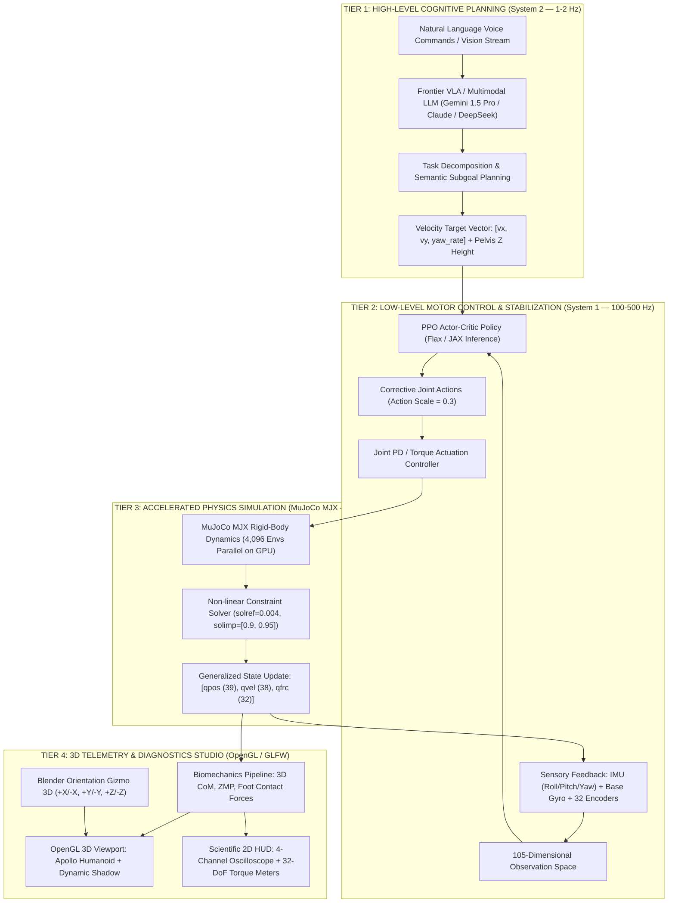
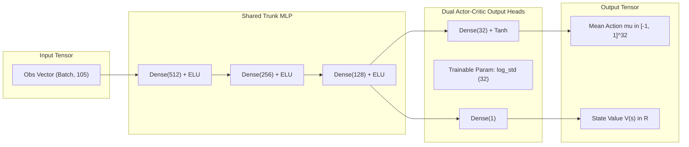
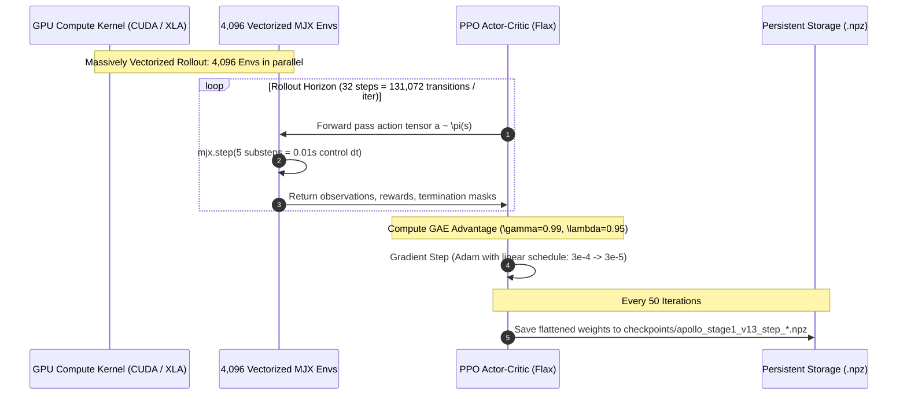

# 🤖 Apptronik Apollo Humanoid — Biomechanics Telemetry & MJX Deep Reinforcement Learning Suite

[](https://www.python.org/)
[](https://mujoco.org/)
[](https://github.com/google-deepmind/mujoco)
[](https://github.com/google/flax)
[-20BEFF?logo=kaggle&logoColor=white)](https://www.kaggle.com/)
[](LICENSE)
[](SECURITY.md)
[](CONTRIBUTING.md)

---

## 📌 1. Project Overview & Research Mission

**`medical-science`** is an advanced scientific research platform uniting **Humanoid Robotics Biomechanics**, **Whole-Body Locomotion Control**, and **Hardware-Accelerated Deep Reinforcement Learning on GPUs**.

The platform is anchored around the state-of-the-art **Apptronik Apollo** industrial humanoid robot model provided by the official **Google DeepMind Menagerie**, while concurrently integrating medical robotics assets from the **da Vinci Research Kit (dVRK)** for surgical biomechanics and rehabilitation research.

### 🎯 Core Engineering Objectives

1. **High-Fidelity Dynamics & Kinematics Simulation:** Accurately simulate non-linear rigid body multi-contact dynamics across 32 degrees of freedom (DoF), an overall mass of **80.898 kg**, and peak actuator torques reaching **$\pm 494.0$ Nm** per hip joint.
2. **Massively Vectorized GPU Reinforcement Learning (MuJoCo MJX + JAX):** Simultaneously simulate and train across **4,096 parallel environments** allocated natively inside GPU VRAM, unlocking simulation throughput exceeding **540,000+ steps per second (SPS)**.
3. **Real-Time 3D Biomechanics Telemetry Studio:** Deliver a high-framerate, interactive diagnostic environment computing real-time 3D Center of Mass (CoM), Ground Reaction Forces (GRF), Zero Moment Point (ZMP), and dynamic Support Polygons.
4. **Automated Dual-Cloud Deployment:** Provide single-command headless training pipelines targeting **Kaggle Dual NVIDIA T4** and **Google Colab GPU** instances with seamless parameter checkpointing and automatic resumption.

---

## 🏛️ 2. Hierarchical System Architecture

The control architecture is organized into a biologically inspired two-tier hierarchical framework:



---

## 📊 3. Hardware & Kinematic Specifications

Exact physical, kinematic, and dynamic parameters extracted directly from [`scene.xml`](file:///d:/GitHub/medical-science/google_deepmind_menagerie/apptronik_apollo/scene.xml):

| Physical Parameter | Value | Unit | Engineering Description |
| :--- | :---: | :---: | :--- |
| **Total Body Mass ($M_{total}$)** | **80.898** | $kg$ | Complete assembly including structural links, 32 actuators, and torso battery |
| **Nominal Standing Height ($H_{total}$)** | **1.730** | $m$ | Vertical stature from floor ground plane to crown of head |
| **Nominal Standing Pelvis Z ($Z_{nominal}$)** | **1.0160** | $m$ | Base pelvic origin coordinate in nominal upright stance |
| **Configuration Coordinates ($n_q$)** | **39** | — | 7 root free-joint coordinates (3 position + 4 quaternion) + 32 hinge joints |
| **Velocity Degrees of Freedom ($n_v$)** | **38** | — | 6 root spatial velocities (3 linear + 3 angular) + 32 joint rotational velocities |
| **Total Actuated DoF ($n_u$)** | **32** | — | Independent electric servo actuators controlling whole-body joints |
| **Rigid Body Segments ($n_{body}$)** | **37** | — | Pelvis, torso, neck assembly, dual 7-DoF arms, and dual 6-DoF legs |
| **Collision Geometries ($n_{geom}$)** | **80** | — | Convex bounding envelopes and visual surface geometries |
| **Physics Simulation Timestep ($\Delta t_{sim}$)** | **0.002** | $s$ | 500 Hz simulation rate via `mjINT_IMPLICITFAST` integrator |
| **Control Decision Timestep ($\Delta t_{ctrl}$)** | **0.010** | $s$ | 100 Hz decision rate with $n_{substeps} = 5$ physics iterations per policy step |

### 🦾 32-DoF Actuator Registry & Torque Limits

```text
                                [ HEAD & NECK (3 DoF) ]
                           neck_pitch  [-0.26, 0.52] rad | ±34.2 Nm
                           neck_roll   [-0.79, 0.79] rad | ±34.2 Nm
                           neck_yaw    [-1.66, 1.66] rad | ±10.6 Nm
                                         │
               ┌─────────────────────────┴─────────────────────────┐
    [ LEFT ARM (7 DoF) ]                                  [ RIGHT ARM (7 DoF) ]
l_shoulder_fe  [-2.18, 0.61] | ±114 Nm                 r_shoulder_fe  [-2.18, 0.61] | ±114 Nm
l_shoulder_aa  [-0.12, 1.61] | ±78.0 Nm                r_shoulder_aa  [-1.61, 0.12] | ±78.0 Nm
l_shoulder_ie  [-0.47, 0.47] | ±67.0 Nm                r_shoulder_ie  [-0.47, 0.47] | ±67.0 Nm
l_elbow_fe     [-2.62, 0.17] | ±114 Nm                 r_elbow_fe     [-2.62, 0.17] | ±114 Nm
l_wrist_roll   [-1.66, 1.66] | ±10.6 Nm                r_wrist_roll   [-1.66, 1.66] | ±10.6 Nm
l_wrist_yaw    [-0.79, 0.79] | ±34.2 Nm                r_wrist_yaw    [-0.79, 0.79] | ±34.2 Nm
l_wrist_pitch  [-0.84, 1.68] | ±34.2 Nm                r_wrist_pitch  [-1.68, 0.84] | ±34.2 Nm
               │                                                   │
               └─────────────────────────┬─────────────────────────┘
                                  [ TORSO TRUNK (3 DoF) ]
                           torso_pitch [-0.31, 1.35] rad | ±315.0 Nm
                           torso_roll  [-0.21, 0.21] rad | ±414.0 Nm  <-- Anti-lateral roll
                           torso_yaw   [-0.83, 0.83] rad | ±120.0 Nm
                                         │
               ┌─────────────────────────┴─────────────────────────┐
    [ LEFT LEG (6 DoF) ]                                  [ RIGHT LEG (6 DoF) ]
l_hip_aa       [-0.22, 0.74] | ±494.0 Nm  <-- MAX TORQUE --> r_hip_aa       [-0.74, 0.22] | ±494.0 Nm
l_hip_fe       [-1.85, 0.48] | ±342.0 Nm                 r_hip_fe       [-1.85, 0.48] | ±342.0 Nm
l_hip_ie       [-0.57, 1.09] | ±120.0 Nm                 r_hip_ie       [-1.09, 0.57] | ±120.0 Nm
l_knee_fe      [ 0.00, 2.62] | ±336.0 Nm                 r_knee_fe      [ 0.00, 2.62] | ±336.0 Nm
l_ankle_pd     [-1.57, 0.44] | ±150.0 Nm                 r_ankle_pd     [-1.57, 0.44] | ±150.0 Nm
l_ankle_ie     [-0.65, 0.31] | ±120.0 Nm                 r_ankle_ie     [-0.31, 0.65] | ±120.0 Nm
```

---

## 🔬 4. Observation Space & Neural Architecture

### 📐 105-Dimensional Observation Vector

$$\mathbf{O}_t = \left[ \mathbf{u}_z^{body}, \; \mathbf{v}_{base}, \; \boldsymbol{\omega}_{base}, \; (\mathbf{q}_{joint} - \mathbf{q}_{nominal}), \; \dot{\mathbf{q}}_{joint}, \; \mathbf{a}_{t-1} \right] \in \mathbb{R}^{105}$$

- $\mathbf{u}_z^{body} \in \mathbb{R}^3$: Pelvis body Z-axis unit vector in world coordinates derived from orientation quaternion $[q_w, q_x, q_y, q_z]$:
  $$\mathbf{u}_z^{body} = \begin{bmatrix} 2(q_x q_z + q_w q_y) \\ 2(q_y q_z - q_w q_x) \\ 1 - 2(q_x^2 + q_y^2) \end{bmatrix} \quad (\mathbf{u}_z = [0, 0, 1]^T \text{ when strictly upright})$$
- $\mathbf{v}_{base} \in \mathbb{R}^3$: Pelvic root linear velocity vector $[v_x, v_y, v_z]$.
- $\boldsymbol{\omega}_{base} \in \mathbb{R}^3$: Pelvic root angular velocity vector $[\omega_x, \omega_y, \omega_z]$.
- $\Delta \mathbf{q} \in \mathbb{R}^{32}$: Angular position deviation from nominal keyframe posture $\mathbf{q}_{nominal}$.
- $\dot{\mathbf{q}} \in \mathbb{R}^{32}$: Instantaneous angular velocity of the 32 joints.
- $\mathbf{a}_{t-1} \in \mathbb{R}^{32}$: Normalized action vector from previous control cycle.



---

## 🧮 5. Biomechanical Reward Formulation

The reinforcement learning objective follows Google DeepMind humanoid balance formulations, establishing an optimal trade-off between postural stability and metabolic torque efficiency:

$$\mathcal{R}_t = \Delta t \cdot \left[ r_{lin\_vel} + r_{ang\_vel} - c_{vz} - c_{\omega\_xy} - c_{orient} - c_{stand} - c_{torque} - c_{rate} - c_{limit} \right]$$

Detailed breakdown of reward coefficients and physical objectives:

| Component | Weight ($w_i$) | Formulation | Physical & Biomechanical Objective |
| :--- | :---: | :--- | :--- |
| **Linear Velocity Tracking ($r_{lin\_vel}$)** | $+1.0$ | $\exp\left(-\frac{v_x^2 + v_y^2}{\sigma}\right), \; \sigma = 0.25$ | Penalizes lateral planar drift, enforces stationary base |
| **Yaw Spin Suppression ($r_{ang\_vel}$)** | $+0.5$ | $\exp\left(-\frac{\omega_z^2}{\sigma}\right)$ | Suppresses uncommanded rotational spinning around vertical Z axis |
| **Vertical Oscillation Penalty ($c_{vz}$)** | $-2.0$ | $v_z^2$ | Damps vertical bouncing and pelvis pumping |
| **Roll/Pitch Rate Penalty ($c_{\omega\_xy}$)** | $-0.05$ | $\omega_x^2 + \omega_y^2$ | Minimizes lateral swaying and forward/backward torso tilting |
| **Upright Orientation Penalty ($c_{orient}$)** | $-1.0$ | $(u_x^{body})^2 + (u_y^{body})^2$ | Penalizes deviation from gravitational vertical axis |
| **Postural Stance Penalty ($c_{stand}$)** | $-0.5$ | $\sum_{i=1}^{32} \|q_i - q_i^{nominal}\|$ | Encourages nominal limb configurations and prevents awkward joint locks |
| **Actuator Torque Cost ($c_{torque}$)** | $-10^{-4}$ | $\sqrt{\sum \tau_i^2} + \sum \|\tau_i\|$ | Minimizes motor thermal dissipation and energy consumption |
| **Action Smoothness Penalty ($c_{rate}$)** | $-0.01$ | $\sum_{i=1}^{32} (a_{i,t} - a_{i,t-1})^2$ | Enforces second-order action smoothness, eliminating mechanical jitter |
| **Joint Limit Penalty ($c_{limit}$)** | $-10.0$ | $\sum \left( [q - q_{max}]_+ + [q_{min} - q]_+ \right)$ | Strict barrier penalty preventing hard mechanical joint limit collisions |

### 🛑 Early Episode Termination Criteria

An environment episode terminates immediately if either condition is satisfied:

1. **Height Drop:** Pelvis height drops below $Z < 0.75 \times Z_{nominal} = 0.762\text{ m}$.
2. **Excessive Tilt:** Body Z component drops below $u_z^{body} < 0.5$ (tilt angle $> 60^\circ$ relative to gravity).

---

## ⚡ 6. PPO Hyperparameters & Scalability Metrics



| Hyperparameter | Symbol | Value | Architectural Rationale |
| :--- | :---: | :---: | :--- |
| **Parallel Environments** | $N_{envs}$ | **4,096** | 4,096 concurrent humanoid agents evaluated inside unified GPU VRAM |
| **Rollout Step Horizon** | $T$ | **32** | Trajectory segment length per policy iteration |
| **Batch Size per Iteration** | $B$ | **131,072** | $4,096 \times 32$ transitions gathered per gradient step |
| **Total Training Steps** | $N_{total}$ | **100,000,000** | 100M total steps equivalent to $\approx 11.5$ days of physical experience |
| **Total Optimization Iterations** | $N_{iters}$ | **762** | $100,000,000 / 131,072$ policy updates across full training run |
| **GAE Discount Factor** | $\gamma$ | **0.99** | Long-term cumulative return discounting |
| **GAE Lambda** | $\lambda$ | **0.95** | Bias-variance trade-off parameter for Generalized Advantage Estimation |
| **PPO Clipping Coefficient** | $\epsilon$ | **0.2** | Surrogate objective clipping threshold ($r(\theta) \in [0.8, 1.2]$) |
| **Entropy Exploration Coefficient** | $c_{ent}$ | **0.01** | Encourages stochastic exploratory actions during early training stages |
| **Value Function Loss Weight** | $c_{vf}$ | **0.5** | Scaling factor for critic regression loss |
| **Max Gradient Norm** | $g_{max}$ | **0.5** | Gradient clipping threshold preventing catastrophic policy collapse |
| **Learning Rate Schedule** | $\eta$ | **$3 \cdot 10^{-4} \to 3 \cdot 10^{-5}$** | Annealed linearly across 762 iterations |
| **Simulation Throughput (SPS)** | — | **520,000 – 550,000** | Simulated environment steps per physical second on Dual NVIDIA T4 |

---

## 💻 7. Interactive 3D Biomechanics Studio (`main.py`)

The interactive visualization suite is built on **OpenGL / GLFW** with zero-dependency NumPy policy inference (requiring no JAX or CUDA runtime for local evaluation):

```text
┌────────────────────────────────────────────────────────────────────────────────────────┐
│  APOLLO SCIENTIFIC ROBOTICS TELEMETRY SUITE                              [ 3D GIZMO ]  │
│  Pelvis Z: 1.016 m | CoM Vy: +0.002 m/s | Status: ACTIVE BALANCE                 [+Z]   │
├────────────────────────────────┬───────────────────────────────────────┤        │      │
│ 📋 32-DoF JOINT DIAGNOSTICS   │ 📈 REAL-TIME BIOMECHANICS OSCILLOSCOPE │  [-X] ──┼── [+X]
│ - Left Hip FE:        -12.4Nm │ ┌───────────────────────────────────┐ │        │      │
│ - Right Hip FE:       +11.8Nm │ │ ── Channel 1: Pelvis Z Height (m) │ │       [-Z]    │
│ - Left Knee FE:       +45.2Nm │ │ ── Channel 2: Left Foot Fz (N)    │ │               │
│ - Right Knee FE:      +44.8Nm │ │ ── Channel 3: Right Foot Fz (N)   │ │ [FIXED CORNER]│
│ - Torso Pitch:         -8.1Nm │ │ ── Channel 4: CoM Drift Vy (m/s)  │ │               │
│ - Torso Roll:          +1.2Nm │ └───────────────────────────────────┘ │               │
├────────────────────────────────┴───────────────────────────────────────┴───────────────┤
│ [TAB] Toggle HUD | [Arrows/F] Push Perturbation | [Space] Pause | [ESC] Exit           │
└────────────────────────────────────────────────────────────────────────────────────────┘
```

### 🎮 Complete Control Keyboard Shortcuts

| Hotkey | Functional Category | Action Description |
| :---: | :---: | :--- |
| **`TAB`** | **HUD Interface** | **Single Unified Toggle:** Show / hide all 2D telemetry dashboards, text readouts, and oscilloscopes |
| **`Arrows` / `F`** | **Perturbation** | Inject impulsive push disturbances (120 - 150 N) across X/Y planes to test balance recovery |
| **`Left Mouse + Drag`** | **Camera Orbit** | Orbit 3D viewport camera around robot Center of Mass |
| **`Right Mouse + Drag`** | **Camera Zoom** | Zoom camera distance in / out |
| **`Middle Mouse + Drag`** | **Camera Pan** | Pan camera focal center |
| **`Space`** | **Physics Engine** | Toggle simulation pause / run |
| **`R`** | **State Reset** | Reset robot kinematics to default upright standing pose |
| **`F8`** | **Viewport Theme** | Toggle viewport theme between Academic Light and Dark Studio |
| **`P`** | **Diagnostics** | Capture high-resolution screenshot to `pic/` directory |
| **`ESC` / `Q`** | **System Lifecycle** | Gracefully terminate simulation and release 100% of GPU context |

---

## 📂 8. Repository Structure

```text
medical-science/
├── assets/                               # Textures, orientation gizmo assets, TrueType fonts
├── google_deepmind_menagerie/
│   └── apptronik_apollo/                # Official MuJoCo model files for Apptronik Apollo
│       ├── scene.xml                     # Simulation environment, lighting, contact ground plane
│       ├── apollo.xml                    # Kinematics tree, 32 actuators, sensors, inertial parameters
│       └── assets/                       # Surface visual meshes (.obj, .stl) and PBR materials
├── training/                             # Reinforcement learning and cloud training stack
│   ├── env_apollo_mjx.py                 # Vectorized MuJoCo MJX environment class
│   ├── rewards.py                        # Biomechanical reward formulations and termination criteria
│   ├── ppo_mjx_trainer.py                # PPO implementation written in Flax Linen & Optax
│   ├── kaggle_train.py                   # Entrypoint script for Kaggle Dual GPU training
│   ├── push_to_kaggle.py                 # CLI deployment packager for Kaggle API
│   ├── colab_train.py                    # Entrypoint script for Google Colab GPU training
│   ├── push_to_colab.py                  # Automated synchronization and CLI runner for Colab
│   └── test_mini_train_sample.py         # Local smoke-test script verifying gradients and physics
├── kaggle_kernel_deploy/                 # Self-contained deployment kernel for Kaggle
│   └── apollo_humanoid_mjx_training.ipynb
├── colab_deploy/                         # Self-contained deployment kernel for Google Colab
│   └── colab_apollo_humanoid_mjx_training.ipynb
├── colab_apollo_training.ipynb           # Turnkey 1-click Google Colab notebook
├── davinci_dvrk/                         # Surgical robotics simulation models (da Vinci Research Kit)
├── main.py                               # Interactive 3D simulation viewer with biomechanics telemetry
├── run.bat                               # Windows 1-click launcher with process cleanup guards
├── run.ps1                               # PowerShell execution script
├── requirements-train.txt                # Python package dependency specifications
├── Dockerfile                            # Docker container configuration with CUDA 12.2 and OpenGL
└── docker-compose.yml                    # Multi-platform container compose manifest
```

---

## 🚀 9. Getting Started & Setup Guide

### System Requirements

- **Operating System:** Windows 10/11 (64-bit) or Ubuntu 20.04/22.04 LTS.
- **Python:** Python >= 3.10 (Fully tested across Python 3.10 – 3.14).
- **GPU (Recommended for 3D Viewport):** NVIDIA GeForce GTX 1650 / RTX 3050 or higher (OpenGL 3.3+ support).

### Step 1: Clone the repository

```bash
git clone https://github.com/tranvanmanh9325/medical-science.git
cd medical-science
```

### Step 2: Install dependencies

```bash
pip install -r requirements-train.txt
```

### Step 3: Launch the 3D Biomechanics Studio

- **On Windows:** Double-click **`run.bat`** *(Automatically cleans up legacy background processes to prevent GPU thermal throttling, then launches the studio)*.
- **From Command Line:**

  ```powershell
  python main.py
  ```

### Step 4: Run local mini smoke test

Verify mathematical pipeline, policy updates, and checkpoint serialization locally:

```powershell
python training/test_mini_train_sample.py
```

### Step 5: Launch Cloud GPU Training

- **Kaggle Dual T4 Training (Automated CLI):**

  ```powershell
  python training/push_to_kaggle.py
  ```

- **Google Colab T4 Training (1-Click):**
  👉 **[Open Apollo Training Notebook on Google Colab](https://colab.research.google.com/github/tranvanmanh9325/medical-science/blob/main/colab_apollo_training.ipynb)**  
  *(Or execute headlessly via Colab CLI: `python training/push_to_colab.py --run`)*

---

## 👥 10. Contributors & Maintainers

We gratefully acknowledge the contributions of our project team and the global robotics community. As this project expands, all contributors will be recognized in the contributor grid below.

<!-- ALL-CONTRIBUTORS-LIST:START - Do not remove or modify this section -->
<!-- prettier-ignore-start -->
<!-- markdownlint-disable -->
<table align="center">
  <tbody>
    <tr>
      <td align="center" valign="top" width="280">
        <a href="https://github.com/tranvanmanh9325">
          
          <br />
          <br />
          <b>Trần Văn Mạnh</b>
        </a>
        <br />
        <a href="https://github.com/tranvanmanh9325"><sub><b>@tranvanmanh9325</b></sub></a>
        <br />
        <br />
        <small><b>Project Lead & System Architect</b></small>
        <br />
        <small><i>Hanoi University of Science & Technology</i></small>
        <br />
        <small>(Đại học Bách Khoa Hà Nội)</small>
        <br />
        <br />
        <a href="https://github.com/tranvanmanh9325/medical-science/commits?author=tranvanmanh9325" title="Code & Architecture">💻</a>
        <a href="https://github.com/tranvanmanh9325/medical-science/tree/main/docx" title="Biomechanics & Robotics Research">🔬</a>
        <a href="https://github.com/tranvanmanh9325/medical-science/tree/main/training" title="Reinforcement Learning Pipelines">🧠</a>
        <a href="https://github.com/tranvanmanh9325/medical-science/tree/main/docx" title="Scientific Documentation">📖</a>
        <a href="https://github.com/tranvanmanh9325/medical-science" title="Maintenance & Infrastructure">🛠️</a>
        <a href="https://github.com/tranvanmanh9325" title="Project Founder">👑</a>
        <br />
        <br />
        <a href="https://github.com/tranvanmanh9325"></a>
        <a href="https://github.com/tranvanmanh9325/medical-science"></a>
      </td>
      <!-- Additional contributors will be added as new <td> cells to this grid -->
    </tr>
  </tbody>
</table>
<!-- markdownlint-restore -->
<!-- prettier-ignore-end -->
<!-- ALL-CONTRIBUTORS-LIST:END -->

### 🌟 Becoming a Contributor

We warmly welcome contributions from researchers, engineers, and open-source developers worldwide! When your pull request is merged, your profile will be added to the contributor grid above.

- 📖 Review our [Contributing Guidelines](CONTRIBUTING.md) to get started.
- 💡 Submit bug reports or feature proposals on our [Issue Tracker](https://github.com/tranvanmanh9325/medical-science/issues).
- 🚀 Submit a [Pull Request](https://github.com/tranvanmanh9325/medical-science/pulls) to contribute to whole-body biomechanics, reinforcement learning pipelines, or surgical simulation suites.

<p align="center">
  <a href="https://github.com/tranvanmanh9325/medical-science/graphs/contributors">
    
  </a>
</p>

---

## 📚 11. Academic References & Citations

1. **Google DeepMind Menagerie:** [Apptronik Apollo Robot MJCF Model](https://github.com/google-deepmind/mujoco_menagerie/tree/main/apptronik_apollo).
2. **MuJoCo Physics Engine:** E. Todorov, T. Erez, and Y. Tassa, *"MuJoCo: A physics engine for model-based control,"* IEEE/RSJ International Conference on Intelligent Robots and Systems (IROS), 2012.
3. **MuJoCo XLA (MJX):** Google DeepMind, *"Hardware-Accelerated Physics Simulation with MuJoCo in JAX,"* 2023.
4. **Proximal Policy Optimization (PPO):** J. Schulman, F. Wolski, P. Dhariwal, A. Radford, and O. Klimov, *"Proximal Policy Optimization Algorithms,"* arXiv:1707.06347, 2017.
5. **Zero Moment Point (ZMP):** M. Vukobratovic and B. Borovac, *"Zero-moment point — thirty five years of its life,"* International Journal of Humanoid Robotics, 2004.
6. **da Vinci Research Kit (dVRK):** P. Kazanzides, Z. Chen, A. Deguet, G. S. Fischer, R. H. Taylor, and S. P. DiMaio, *"An open-source research kit for the da Vinci Surgical System,"* IEEE ICRA, 2014.

---

> **Advancing Humanoid Robotics, Whole-Body Biomechanics & Medical Science**
