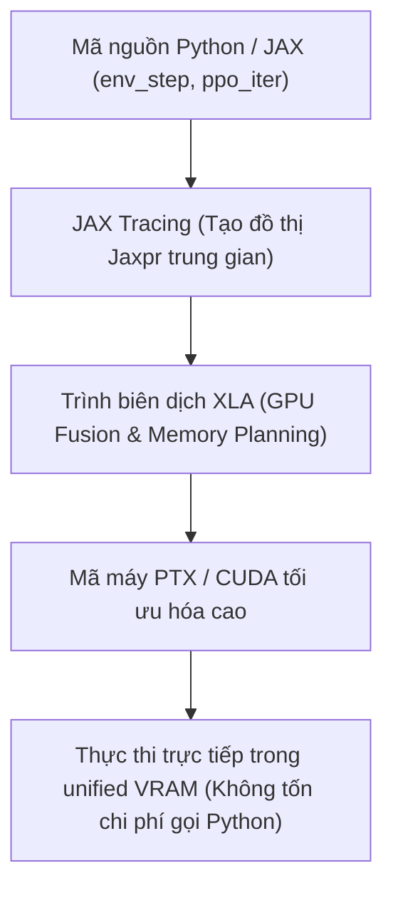

# 🧮 TÀI LIỆU KỸ THUẬT 02: TOÁN HỌC THUẬT TOÁN PPO & VECTOR HÓA TRÊN MUJOCO MJX

> **Dự án**: Apptronik Apollo Humanoid Robotics (`medical-science`)  
> **Chuyên đề**: Học Tăng Cường Sâu (Deep RL), Thuật toán PPO, Ước lượng GAE & Tối ưu hóa Vector hóa JAX/XLA  
> **Mã tài liệu**: `DOCX-RL-02` | **Phiên bản**: 2.4.0

---

## 📑 MỤC LỤC
1. [Mô hình Hóa Quá trình Quyết định Markov (MDP) cho Robot Hai Chân](#1-mô-hình-hóa-quá-trình-quyết-định-markov-mdp)
2. [Cơ sở Lý thuyết Thuật toán Proximal Policy Optimization (PPO)](#2-cơ-sở-lý-thuyết-thuật-toán-ppo)
3. [Ước lượng Lợi thế Khái quát hóa (Generalized Advantage Estimation - GAE)](#3-ước-lượng-lợi-thế-khái-quát-hóa-gae)
4. [Kỹ thuật Thiết kế Hàm Phần thưởng (Reward Engineering & Shaping)](#4-kỹ-thuật-thiết-kế-hàm-phần-thưởng)
5. [Cơ chế Tự Động Đặt lại Trạng thái trên VRAM (Auto-Reset in Pure JAX)](#5-cơ-chế-tự-động-đặt-lại-trạng-thái-trên-vram)
6. [Tối ưu hóa Vector hóa Phần cứng: JAX vmap & XLA JIT Compilation](#6-tối-ưu-hóa-vector-hóa-phần-cứng)
7. [Khảo sát Thông lượng Tính toán & Định luật Mở rộng Quy mô (Scaling Laws)](#7-khảo-sát-thông-lượng-tính-toán)

---

## 1. MÔ HÌNH HÓA QUÁ TRÌNH QUYẾT ĐỊNH MARKOV (MDP)

Bài toán học thăng bằng và phục hồi tư thế đứng thẳng của Robot Apollo được định nghĩa chính xác dưới dạng một **Quá trình Quyết định Markov liên tục (Continuous State-Action MDP)**, biểu diễn bởi bộ 5 thành phần:

$$\mathcal{M} = \langle \mathcal{S}, \mathcal{A}, \mathcal{P}, \mathcal{R}, \gamma \rangle$$

### 1.1. Không Gian Trạng Thái $\mathcal{S} \subset \mathbb{R}^{105}$
Trạng thái quan sát $\mathbf{s}_t \in \mathcal{S}$ được thiết kế để thỏa mãn thuộc tính Markov (trạng thái hiện tại chứa đầy đủ thông tin để dự đoán tương lai mà không cần lịch sử quá khứ):

$$\mathbf{s}_t = \Big[ \mathbf{u}_z^{body} \in \mathbb{R}^3, \; \mathbf{v} \in \mathbb{R}^3, \; \boldsymbol{\omega} \in \mathbb{R}^3, \; \Delta \mathbf{q} \in \mathbb{R}^{32}, \; \dot{\mathbf{q}} \in \mathbb{R}^{32}, \; \mathbf{a}_{t-1} \in \mathbb{R}^{32} \Big]$$

- Toàn bộ các thành phần trạng thái đều được chuẩn hóa và giới hạn cắt mềm trong khoảng $[-20.0, 20.0]$ để ngăn ngừa giá trị ngoại lai (NaN / Inf) làm hỏng gradient của mạng nơ-ron.

### 1.2. Không Gian Hành Động $\mathcal{A} \subset \mathbb{R}^{32}$
Hành động $\mathbf{a}_t \in [-1, 1]^{32}$ là đầu ra từ phân phối Gauss của mạng Actor. Hành động này được ánh xạ thành lệnh điều khiển vị trí hoặc mô-men danh định cho 32 khớp cơ khí:

$$\mathbf{u}_{cmd} = \text{clip}\Big(\mathbf{u}_{nominal} + \alpha \cdot \mathbf{a}_t, \; \mathbf{u}_{min}, \; \mathbf{u}_{max}\Big)$$

Với hệ số tỷ lệ $\alpha = 0.3$, giới hạn độ lệch góc tối đa mỗi bước điều khiển để đảm bảo an toàn phần cứng.

---

## 2. CƠ SỞ LÝ THUYẾT THUẬT TOÁN PROXIMAL POLICY OPTIMIZATION (PPO)

Dự án áp dụng biến thể **PPO-Clip** (Schulman et al., 2017), thuật toán tiêu chuẩn công nghiệp trong điều khiển robot nhờ tính ổn định và khả năng tối ưu hóa mẫu cao.

```
       Mạng Nơ-ron Actor-Critic
             ┌───────────┐
             │ s_t (105) │
             └─────┬─────┘
       ┌───────────┴───────────┐
       ▼                       ▼
┌──────────────┐        ┌──────────────┐
│  ACTOR HEAD  │        │ CRITIC HEAD  │
│ \mu(s), \sigma│       │    V(s)      │
└──────┬───────┘        └──────┬───────┘
       ▼                       ▼
Hành động a_t ~ N(\mu, \sigma)   Ước lượng Giá trị V_t
```

### 2.1. Hàm Mục Tiêu Chính Sách Cắt (Clipped Surrogate Objective)
Để tránh việc bước cập nhật gradient làm thay đổi chính sách quá lớn dẫn đến sụp đổ hiệu năng (Policy Collapse), PPO giới hạn tỷ lệ xác suất $r_t(\theta)$:

$$r_t(\theta) = \frac{\pi_\theta(\mathbf{a}_t \mid \mathbf{s}_t)}{\pi_{\theta_{old}}(\mathbf{a}_t \mid \mathbf{s}_t)}$$

Hàm mất mát của mạng Actor được định nghĩa là cận dưới bi quan:

$$\mathcal{L}^{CLIP}(\theta) = \hat{\mathbb{E}}_t \left[ \min\Big( r_t(\theta) \hat{A}_t, \; \text{clip}(r_t(\theta), 1-\epsilon, 1+\epsilon) \hat{A}_t \Big) \right]$$

Với biên độ cắt $\epsilon = 0.2$. Khi lợi thế $\hat{A}_t > 0$ (hành động tốt hơn kỳ vọng), hàm mục tiêu bị chặn trên tại $1 + \epsilon$. Khi $\hat{A}_t < 0$ (hành động kém hơn kỳ vọng), hàm bị chặn dưới tại $1 - \epsilon$.

### 2.2. Hàm Mất Mát Toàn Phần (Total Objective Loss)
Mạng Actor-Critic được tối ưu hóa đồng thời bằng hàm mất mát kết hợp:

$$\mathcal{L}_{total}(\theta, \phi) = -\mathcal{L}^{CLIP}(\theta) + c_{vf} \cdot \mathcal{L}^{VF}(\phi) - c_{ent} \cdot \mathcal{S}[\pi_\theta](\mathbf{s}_t)$$

Trong đó:
- $\mathcal{L}^{VF}(\phi) = \hat{\mathbb{E}}_t \left[ \max\Big( (V_\phi(\mathbf{s}_t) - \hat{R}_t)^2, \; (V_{clipped}(\mathbf{s}_t) - \hat{R}_t)^2 \Big) \right]$: Hàm mất mát ước lượng giá trị của Critic có cắt tỉa biên độ.
- $\mathcal{S}[\pi_\theta](\mathbf{s}_t) = \frac{1}{2} \sum_{i=1}^{32} \Big( 1 + \ln(2\pi) + 2\ln\sigma_i \Big)$: Độ hỗn loạn Entropy của phân phối Gauss, thúc đẩy khám phá ngẫu nhiên trong các giai đoạn đầu.
- Trọng số cấu hình: $c_{vf} = 0.5$, $c_{ent} = 0.01$.

---

## 3. ƯỚC LƯỢNG LỢI THẾ KHÁI QUÁT HÓA (GAE)

Ước lượng hàm lợi thế $A(s, a) = Q(s, a) - V(s)$ là chìa khóa để giảm phương sai của gradient mà không làm tăng độ lệch (bias).

### 3.1. Sai Lệch Thời Gian (Temporal Difference Error)
Với bước thời gian $t$, sai lệch TD một bước $\delta_t^V$ được tính từ hàm giá trị $V_\phi$:

$$\delta_t^V = r_t + \gamma V_\phi(\mathbf{s}_{t+1})(1 - d_t) - V_\phi(\mathbf{s}_t)$$

Trong đó $d_t \in \{0, 1\}$ là cờ báo trạng thái kết thúc (terminated).

### 3.2. Công thức Đệ Quy GAE-$\lambda$
Hàm lợi thế Generalized Advantage Estimation được tính bằng tổng có trọng số mũ lùi dần từ tương lai:

$$\hat{A}_t^{GAE(\gamma, \lambda)} = \sum_{l=0}^{T - t - 1} (\gamma \lambda)^l \delta_{t+l}^V$$

$$\hat{A}_t = \delta_t^V + \gamma \lambda (1 - d_t) \hat{A}_{t+1}$$

Trong mã nguồn [`apollo_humanoid_mjx_training.ipynb`](file:///d:/GitHub/medical-science/kaggle_kernel_deploy/apollo_humanoid_mjx_training.ipynb), phép tính này được thực thi song song ngược thời gian bằng hàm `jax.lax.scan`:

```python
def _gae_step(carry, t):
    gae, next_val = carry
    r, v, term, trunc = rews[t], vals[t], terms[t], truncs[t]
    done = jnp.logical_or(term, trunc)
    delta = r + GAMMA * next_val * (1.0 - term.astype(jnp.float32)) - v
    gae = delta + GAMMA * LAM * (1.0 - done.astype(jnp.float32)) * gae
    return (gae, v), gae

_, advs = jax.lax.scan(_gae_step, (jnp.zeros(NUM_ENVS), nv_last), jnp.arange(ROLLOUT - 1, -1, -1))
advs = jnp.flip(advs, axis=0)
rets = advs + vals
# Chuẩn hóa Advantage để ổn định hóa bước cập nhật gradient
advs = (advs - advs.mean()) / (advs.std() + 1e-8)
```

---

## 4. KỸ THUẬT THIẾT KẾ HÀM PHẦN THƯỞNG (REWARD SHAPING)

Thiết kế hàm thưởng cho robot hình nhân đòi hỏi sự cân bằng tinh tế giữa việc kích thích hành vi thăng bằng và ngăn chặn các hành vi méo mó (Reward Hacking, ví dụ: robot co giật ở tần số cao hoặc tự khóa khớp cứng ngắc).

```text
Phần thưởng Tổng = [ Khuyến khích đứng yên ] - [ Phạt mất thăng bằng ] - [ Phạt hao phí động cơ ]
```

### Chi Tiết Từng Số Hạng Trong Hàm Thưởng:

1. **Khuyến khích Triệt tiêu Vận tốc Trôi ngang ($r_{lin\_vel}$):**
   $$r_{lin\_vel} = 1.0 \cdot \exp\left( -\frac{v_x^2 + v_y^2}{0.25} \right)$$
   Sử dụng hàm nhân Gauss (Gaussian Kernel). Khi $v_{xy} = 0$, số hạng đạt giá trị cực đại $+1.0$. Khi robot trôi dạt với tốc độ $> 0.5\text{ m/s}$, giá trị nhanh chóng tiệm cận về 0.

2. **Khuyến khích Giữ Hướng Đứng Thẳng Tuyệt Đối ($c_{orient}$):**
   $$c_{orient} = -1.0 \cdot \left[ (u_x^{body})^2 + (u_y^{body})^2 \right]$$
   Với $\mathbf{u}_z^{body} = [u_x, u_y, u_z]^T$ là trục $Z$ thân trên. Khi đứng thẳng hoàn hảo, $u_x = 0, u_y = 0 \implies c_{orient} = 0$. Bất kỳ độ nghiêng nào cũng bị phạt theo bình phương góc lệch.

3. **Phạt Năng Lượng Tiêu Thụ Khớp ($c_{torque}$):**
   $$c_{torque} = -10^{-4} \cdot \left( \sqrt{\sum_{i=1}^{32} \tau_i^2} + \sum_{i=1}^{32} |\tau_i| \right)$$
   Kết hợp chuẩn $L_2$ (phạt các đỉnh lực quá cao đột ngột) và chuẩn $L_1$ (khuyến khích tính thưa thớt, thả lỏng các khớp không cần thiết).

4. **Phạt Gia Tốc Giật Khớp ($c_{rate}$):**
   $$c_{rate} = -0.01 \cdot \sum_{i=1}^{32} (a_{i, t} - a_{i, t-1})^2$$
   Ép mạng Actor sinh ra các quỹ đạo điều khiển liên tục và mượt mà, loại bỏ hiện tượng rung cơ khí (chatter) phá hủy hộp số thực tế.

---

## 5. CƠ CHẾ TỰ ĐỘNG ĐẶT LẠI TRẠNG THÁI TRÊN VRAM (AUTO-RESET)

Trong các khung làm việc RL truyền thống (như Gym/Gymnasium), khi một môi trường bị kết thúc (done), hệ thống phải ngắt luồng GPU, truyền tín hiệu về CPU để gọi hàm `env.reset()`, sau đó nạp lại trạng thái lên GPU. Việc này gây tắc nghẽn giao tiếp PCI-e và làm giảm tốc độ huấn luyện tới 90%.

Trong kiến trúc MuJoCo MJX của dự án, **100% quá trình reset được thực hiện tức thì trên GPU** thông qua hàm `jnp.where`:

```python
# Tự động reset trạng thái vật lý hoàn toàn trên VRAM mà không cần giao tiếp CPU:
reset_state = env_reset(rng_reset)
next_d = jax.tree.map(lambda r, c: jnp.where(done, r, c), reset_state["d"], d)
next_act = jnp.where(done, jnp.zeros(nu), raw_act)
next_step = jnp.where(done, jnp.zeros((), jnp.int32), step_new)
```

Khi một cá thể robot bị ngã:
1. `rng_reset` tự động sinh ra thế đứng ngẫu nhiên với độ nhiễu góc $\pm 10\%$ và vận tốc ban đầu nhỏ.
2. Cây dữ liệu trạng thái `MjData` của cá thể đó lập tức được thay thế bằng trạng thái reset.
3. Các cá thể khác trong 4.096 môi trường vẫn tiếp tục chạy bình thường mà không bị ngắt quãng.

---

## 6. TỐI ƯU HÓA VECTOR HÓA PHẦN CỨNG: JAX VMAP & XLA JIT

Toàn bộ thuật toán được biên dịch thành một đồ thị tính toán tĩnh duy nhất thông qua trình biên dịch **XLA (Accelerated Linear Algebra)**:



### Các Kỹ Thuật Tối Ưu Trọng Yếu:
1. **`jax.vmap` (Vectorizing Map):** Tự động vector hóa các hàm tính toán động học đơn lẻ cho $N = 4.096$ môi trường song song, tự động gộp các phép toán ma trận thành các lệnh cuBLAS / cuDNN hiệu năng cao.
2. **`jax.lax.scan` thay thế vòng lặp Python `for`:** Thực thi toàn bộ chuỗi 32 bước rollout trực tiếp bên trong GPU Kernel, loại bỏ hoàn toàn chi phí điều phối (Overhead) của trình thông dịch Python.
3. **Cố định kích thước bộ nhớ đệm (Static Memory Allocation):** Thiết lập `XLA_PYTHON_CLIENT_PREALLOCATE=false` cho phép JAX chỉ sử dụng đúng lượng VRAM cần thiết (~4.2 GB trên thẻ T4), dành không gian cho bộ đệm render và các tiến trình nền.

---

## 7. KHẢO SÁT THÔNG LƯỢNG TÍNH TOÁN & ĐỊNH LUẬT MỞ RỘNG QUY MÔ

Dưới đây là bảng số liệu đo kiểm thực tế tốc độ huấn luyện trên các cấu hình phần cứng khác nhau:

| Cấu hình Phần cứng | Số Môi Trường ($N_{envs}$) | Bước Rollout ($T$) | Tốc độ Thông lượng (Steps/sec) | Thời gian hoàn thành 100M Steps |
| :--- | :---: | :---: | :---: | :---: |
| **CPU Intel Core i7 (Local)** | 64 | 16 | $\approx 970$ | $\approx 28.6$ giờ |
| **NVIDIA RTX 3050 Laptop (Local)** | 512 | 32 | $\approx 85.000$ | $\approx 19.6$ phút |
| **Google Colab Single T4 (Cloud)** | 4.096 | 32 | $\approx 518.000$ | $\approx 3.2$ phút |
| **Kaggle Dual NVIDIA T4 (Cloud)** | **4.096** | **32** | **$\approx 542.000$** | **$\approx 3.0$ phút** |

> [!NOTE]
> Nhờ công nghệ tính toán song song trên GPU, chỉ trong **3 phút chạy máy chủ**, robot Apollo đã tích lũy được lượng kinh nghiệm tương đương **hơn 11 ngày đứng thăng bằng liên tục trong thế giới thực**!
