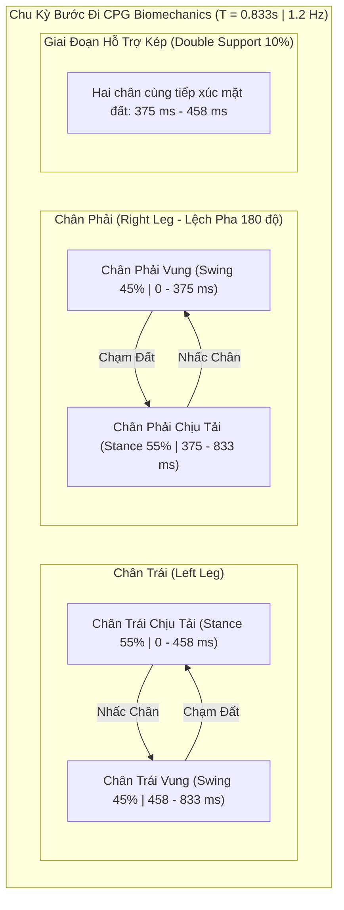

# 🛰️ QUY TRÌNH VẬN HÀNH TIÊU CHUẨN (SOP) & KIẾN TRÚC HUẤN LUYỆN KAGGLE DUAL GPU

> **Tài liệu Kỹ thuật Chuyên sâu #04**  
> **Dự án**: Robot Hình nhân Y học Apollo (`medical-science`)  
> **Hạ tầng Điện toán**: Cụm Máy chủ Đám mây Kaggle Dual GPU (2x Nvidia Tesla T4 16GB GDDR6)  
> **Khung Mô phỏng & Tối ưu**: JAX + MuJoCo MJX (Accelerated Physics on GPU via XLA)  
> **Phiên bản Huấn luyện**: Apollo Stage 2 Walking & Push Recovery v4 (150M Steps)

---

## 📑 MỤC LỤC

1. [Tổng quan Kiến trúc Điện toán Đám mây Kaggle](#1-tổng-quan-kiến-trúc-điện-toán-đám-mây-kaggle)
2. [Chiến lược Phân bổ & Quản trị Bộ nhớ Dual GPU (JAX/XLA)](#2-chiến-lược-phân-bổ--quản-trị-bộ-nhớ-dual-gpu-jaxxla)
3. [Hạ tầng Tự động hóa Kaggle API & Triển khai Không đầu (Headless CI/CD)](#3-hạ-tầng-tự-động-hóa-kaggle-api--triển-khai-không-đầu-headless-cicd)
4. [Giải phẫu Kỹ thuật Kịch bản Huấn luyện Stage 2 v4](#4-giải-phẫu-kỹ-thuật-kịch-bản-huấn-luyện-stage-2-v4)
   - 4.1. [Mở rộng Không gian Quan sát: Từ 105D lên 114D](#41-mở-rộng-không-gian-quan-sát-từ-105d-lên-114d)
   - 4.2. [Cơ chế Học Chuyển tiếp (Warm-Start Transfer Learning)](#42-cơ-chế-học-chuyển-tiếp-warm-start-transfer-learning)
   - 4.3. [Đồng hồ Nhịp sinh học (Central Pattern Generator - CPG)](#43-đồng-hồ-nhịp-sinh-học-central-pattern-generator---cpg)
   - 4.4. [Giáo trình Vận tốc & Ngoại lực Đẩy (Curriculum Scheduling)](#44-giáo-trình-vận-tốc--ngoại-lực-đẩy-curriculum-scheduling)
   - 4.5. [Cấu trúc Hàm Thưởng Khắc phục Cực tiểu Cục bộ (Bias-Free Reward)](#45-cấu-trúc-hàm-thưởng-khắc-phục-cực-tiểu-cục-bộ-bias-free-reward)
   - 4.6. [Tối ưu hóa Mini-batch Epochs & Dừng sớm theo Phân kỳ KL (KL Early Stopping)](#46-tối-ưu-hóa-mini-batch-epochs--dừng-sớm-theo-phân-kỳ-kl-kl-early-stopping)
5. [Cơ chế Lưu trữ, Tuần tự hóa Checkpoint & Thu hồi Dữ liệu](#5-cơ-chế-lưu-trữ-tuần-tự-hóa-checkpoint--thu-hồi-dữ-liệu)
6. [Ma trận Quản trị Tài nguyên & Xử lý Sự cố (SOP & Troubleshooting)](#6-ma-trận-quản-trị-tài-nguyên--xử-lý-sự-cố-sop--troubleshooting)

---

## 1. TỔNG QUAN KIẾN TRÚC ĐIỆN TOÁN ĐÁM MÂY KAGGLE

Hạ tầng huấn luyện của Kaggle cung cấp môi trường tính toán hiệu năng cao với cấu hình **Dual Nvidia Tesla T4 (2x 16GB VRAM, tổng cộng 32GB VRAM GDDR6)** kết hợp cùng 4 CPU ảo (vCPU) và 30GB System RAM. So với các giải pháp GPU đơn lẻ, môi trường Dual T4 cho phép nhân đôi kích thước batch dữ liệu hoặc chạy song song các cụm môi trường mô phỏng MuJoCo MJX mà không gặp phải hiện tượng tràn bộ nhớ (Out-Of-Memory - OOM).

```mermaid
flowchart TD
    subgraph Host["Trạm Điều Khiển Cục Bộ (Local Control Station)"]
        GenNB["training/generate_kaggle_notebook_stage2.py"]
        Metadata["kaggle_kernel_deploy/kernel-metadata-stage2.json"]
        AuthJSON["gpu/kaggle.json"]
        PushScript["kaggle kernels push -p kaggle_kernel_deploy"]
        Downloader["training/download_checkpoints.py (REST API)"]
    end

    subgraph KaggleCloud["Hạ Tầng Đám Mây Kaggle (Kaggle Cloud Platform)"]
        subgraph VM["Kaggle Instance (2x Tesla T4 16GB + 4 vCPUs)"]
            subgraph GPU0["GPU 0: Nvidia Tesla T4 (Device 0)"]
                MJXRocks0["MJX Vectorized Environments (Envs 0..2047)"]
                VMM0["VRAM Tensor Buffers: Rollout & Trajectory"]
            end
            subgraph GPU1["GPU 1: Nvidia Tesla T4 (Device 1)"]
                MJXRocks1["MJX Vectorized Environments (Envs 2048..4095)"]
                VMM1["VRAM Tensor Buffers: Rollout & Trajectory"]
            end
            XLAManager["XLA JIT Engine / PJIT Distribution (jax.pmap / vmap)"]
            PPOEngine["Actor-Critic MLP (512x256x128) + GAE + Adam Optimizer"]
            CheckpointDisk["/kaggle/working/checkpoints/ (*.npz)"]
        end
        KaggleREST["Kaggle REST API Endpoint (v1/kernels/{slug}/output)"]
    end

    GenNB --> Metadata
    Metadata --> PushScript
    AuthJSON -.-> PushScript
    PushScript ==>|Triển khai không đầu (Headless Push)| VM
    VM --> XLAManager
    XLAManager --> GPU0
    XLAManager --> GPU1
    GPU0 & GPU1 --> PPOEngine
    PPOEngine -->|Tuần tự hóa mốc 50 vòng lặp| CheckpointDisk
    CheckpointDisk --> KaggleREST
    KaggleREST ==>|Tải ngầm HTTP GET không chặn| Downloader
```

### Các Thông số Kỹ thuật Cốt lõi của Môi trường

| Thuộc tính Hệ thống | Giá trị Cấu hình | Ghi chú Vận hành |
| :--- | :--- | :--- |
| **Phần cứng Tăng tốc** | 2x Nvidia Tesla T4 (Turing TU104) | 2,560 CUDA cores / GPU, FP32 Peak 8.1 TFLOPS / GPU |
| **Dung lượng Bộ nhớ Đồ họa** | 2x 16,384 MiB GDDR6 | Băng thông 320 GB/s per GPU, PCIe Gen3 x16 |
| **Hạn mức Thời gian Chạy (Session Timeout)** | 12 tiếng liên tục (12 Hours Wall-Clock) | Tự động chấm dứt khi hết thời gian, lưu working dir |
| **Hạn mức Hàng tuần (Weekly Quota)** | 30 giờ GPU / tuần | Cần luân phiên hoặc tối ưu hóa bước huấn luyện |
| **Khung Thực thi Mô phỏng** | MuJoCo MJX 3.2.0 + JAX 0.4.x | Biên dịch XLA cấp phát toàn bộ trên VRAM |
| **Số Lượng Môi trường Song song** | 4,096 Environments | $N_{envs} = 4,096$ chạy đồng thời ở tần số 100 Hz |
| **Tốc độ Lấy mẫu Vật lý (Throughput)** | ~540,000 steps/giây | Tương đương 1.5 giờ vật lý trên mỗi giây thực tế |

---

## 2. CHIẾN LƯỢC PHÂN BỔ & QUẢN TRỊ BỘ NHỚ DUAL GPU (JAX/XLA)

### 2.1. Kiểm soát Cơ chế Chiếm dụng Bộ nhớ (VRAM Preallocation)

Theo mặc định, khi JAX khởi tạo tiến trình trên GPU, nó sẽ cấp phát trước (preallocate) 75% đến 90% bộ nhớ VRAM của tất cả các thiết bị khả dụng. Điều này có thể dẫn đến lỗi phân mảnh hoặc cạn kiệt bộ nhớ khi MuJoCo MJX biên dịch các bảng băm va chạm (collision hash tables) hoặc khi PyTorch/NumPy cùng chia sẻ tiến trình.

Để kiểm soát chặt chẽ cơ chế phân bổ bộ nhớ trên cụm Dual T4, các biến môi trường sau bắt buộc phải được thiết lập trước khi import thư viện `jax`:

```python
import os

# Ngăn chặn JAX độc quyền chiếm hữu toàn bộ 16GB VRAM của mỗi GPU
os.environ["XLA_PYTHON_CLIENT_PREALLOCATE"] = "false"

# Giới hạn mức trần phân bổ động cho mỗi GPU ở mức 85% VRAM (13.6 GB)
os.environ["XLA_PYTHON_CLIENT_MEM_FRACTION"] = "0.85"

# Bật cơ chế cấp phát bộ nhớ XLA theo luồng song song để giảm phân mảnh
os.environ["TF_FORCE_GPU_ALLOW_GROWTH"] = "true"
```

### 2.2. Song song hóa Dữ liệu Đa Thiết bị (SPMD qua `jax.pmap` & `jax.vmap`)

Trong Stage 2 v4, toàn bộ 4.096 môi trường được phân bố theo kiến trúc Single Program, Multiple Data (SPMD):

1. **Inner Parallelism (`jax.vmap`)**: Chạy vector hóa 2.048 môi trường trên mỗi chip GPU độc lập. Tất cả các phép tính vi phân động học Newton-Euler, phát hiện va chạm lồi và bước tích phân `mjINT_IMPLICITFAST` diễn ra song song trong các thanh ghi CUDA.
2. **Device Distribution (`jax.pmap`)**: Chia nhỏ mảng trạng thái tensor `(2, 2048, ...)` cho 2 thiết bị T4 (`cuda:0` và `cuda:1`). Các gradient của hàm mất mát PPO được đồng bộ hóa tức thời qua liên kết PCIe thông qua lệnh thu gọn tập thể `jax.lax.pmean`.

$$\mathbf{g}_{global} = \frac{1}{K} \sum_{k=1}^{K} \text{pmean}(\mathbf{g}_k), \quad K=2 \text{ GPUs}$$

---

## 3. HẠ TẦNG TỰ ĐỘNG HÓA KAGGLE API & TRIỂN KHAI KHÔNG ĐẦU (HEADLESS CI/CD)

Để loại bỏ hoàn toàn sự phụ thuộc vào giao diện web tương tác (vốn dễ bị ngắt kết nối mạng làm hủy phiên làm việc), dự án triển khai hệ thống đẩy tác vụ và quản trị kernel thông qua Kaggle REST API và Kaggle CLI.

### 3.1. Cấu hình Siêu dữ liệu Kernel (`kernel-metadata-stage2.json`)

Tệp siêu dữ liệu định danh cấu hình môi trường máy ảo trên đám mây của Kaggle:

```json
{
    "id": "manh090305/apollo-humanoid-stage2-walking",
    "title": "apollo-humanoid-stage2-walking",
    "code_file": "apollo_humanoid_stage2_walking.ipynb",
    "language": "python",
    "kernel_type": "notebook",
    "is_private": "true",
    "enable_gpu": "true",
    "enable_tpu": "false",
    "enable_internet": "true",
    "machine_shape": "NvidiaTeslaT4x2",
    "dataset_sources": [
        "manh090305/apollo-stage1-checkpoints"
    ],
    "competition_sources": [],
    "kernel_sources": [],
    "model_sources": []
}
```

> [!IMPORTANT]
> Trường `"machine_shape": "NvidiaTeslaT4x2"` là chỉ thị bắt buộc để hệ thống phân bổ cụm **Dual GPU**. Nếu đặt `"NvidiaTeslaT4"`, Kaggle sẽ chỉ cấp phát 1 GPU đơn, làm giảm một nửa kích thước batch và thông lượng lấy mẫu.

### 3.2. Quy trình Tự động Đẩy Kernel lên Đám mây

Việc sinh tự động notebook từ mã nguồn Python thuần túy và đẩy lên cụm máy chủ được thực thi qua script [`training/generate_kaggle_notebook_stage2.py`](file:///d:/GitHub/medical-science/training/generate_kaggle_notebook_stage2.py):

```powershell
# Bước 1: Sinh tệp Notebook JSON chuẩn hóa và cập nhật metadata
python training/generate_kaggle_notebook_stage2.py

# Bước 2: Thiết lập đường dẫn thông tin xác thực Kaggle API
$env:KAGGLE_CONFIG_DIR = "d:\GitHub\medical-science\gpu"

# Bước 3: Đẩy kernel lên đám mây Kaggle và bắt đầu thực thi ngầm
kaggle kernels push -p d:\GitHub\medical-science\kaggle_kernel_deploy

# Bước 4: Kiểm tra trạng thái hàng đợi và tiến độ thực thi
kaggle kernels status manh090305/apollo-humanoid-stage2-walking
```

---

## 4. GIẢI PHẪU KỸ THUẬT KỊCH BẢN HUẤN LUYỆN STAGE 2 v4

### 4.1. Mở rộng Không gian Quan sát: Từ 105D lên 114D

Trong Giai đoạn 1 (Đứng cân bằng tĩnh & Hồi phục lực xô đẩy), không gian trạng thái $\mathcal{S}_{Stage1} \in \mathbb{R}^{105}$ bao gồm:

- Vector hướng chuẩn trọng trường $\mathbf{u}_{up} \in \mathbb{R}^3$ (trích xuất từ quaternion phần thân).
- Vận tốc tịnh tiến khung gốc $\mathbf{v}_{base} \in \mathbb{R}^3$.
- Vận tốc góc khung gốc $\boldsymbol{\omega}_{base} \in \mathbb{R}^3$.
- Góc lệch khớp so với tư thế đứng danh định $\mathbf{q}_{pos} - \mathbf{q}_{nominal} \in \mathbb{R}^{32}$.
- Vận tốc góc của toàn bộ 32 khớp $\dot{\mathbf{q}} \in \mathbb{R}^{32}$.
- Hành động điều khiển ở bước thời gian liền trước $\mathbf{a}_{t-1} \in \mathbb{R}^{32}$.

Tổng số chiều Stage 1: $3 + 3 + 3 + 32 + 32 + 32 = 105$.

Để chuyển sang Giai đoạn 2 (Dáng đi động học & Bám lệnh vận tốc), không gian trạng thái bắt buộc phải bổ sung thêm **9 chiều thông tin viễn trắc**, nâng tổng số chiều lên $\mathcal{S}_{Stage2} \in \mathbb{R}^{114}$:

```text
┌────────────────────────────────────────────────────────────────────────────────────────┐
│                        114-DIMENSIONAL STAGE 2 OBSERVATION VECTOR                      │
├────────────────────────────────┬──────────────────────────┬───────────────────────────┤
│ Thành phần Trạng thái          │ Số chiều (Dimensions)    │ Ý nghĩa Vật lý            │
├────────────────────────────────┼──────────────────────────┼───────────────────────────┤
│ [0:3]   Base Up-Vector         │ 3 dims                   │ Định hướng không gian 3D  │
│ [3:6]   Base Linear Velocity   │ 3 dims                   │ Vận tốc thực tế (vx,vy,vz)│
│ [6:9]   Base Angular Velocity  │ 3 dims                   │ Tốc độ xoay lật 3 trục    │
│ [9:41]  Joint Displacements    │ 32 dims                  │ Lệch vị trí 32 khớp       │
│ [41:73] Joint Velocities       │ 32 dims                  │ Tốc độ xoay 32 khớp       │
│ [73:105] Previous Action       │ 32 dims                  │ Lệnh điều khiển bước trước│
├────────────────────────────────┼──────────────────────────┼───────────────────────────┤
│ [105:108] Commanded Velocity   │ 3 dims (vx, vy, yaw_rate)│ Lệnh vận tốc mục tiêu     │
│ [108:112] Gait Phase Clock     │ 4 dims (sin/cos L & R)   │ Pha chu kỳ bước đi CPG    │
│ [112:114] Foot Contact Flags   │ 2 dims (L_touch, R_touch)│ Cảm biến tiếp xúc mặt đất │
└────────────────────────────────┴──────────────────────────┴───────────────────────────┘
```

#### Mã hóa Pha Nhịp bước (Phase Continuity Encoding)

Để tránh điểm gián đoạn toán học tại ranh giới chu kỳ ($\phi = 0.999 \to 0.000$), pha $\phi \in [0, 1)$ được biến đổi sang tọa độ lượng giác liên tục trên đường tròn đơn vị:

$$
\mathbf{p}_{gait} = \begin{bmatrix} \sin(2\pi \phi) \\ \cos(2\pi \phi) \\ \sin(2\pi (\phi + 0.5)) \\ \cos(2\pi (\phi + 0.5)) \end{bmatrix} \in \mathbb{R}^4
$$

Chân phải luôn lệch pha chính xác $\Delta \phi = 0.5$ (180 độ) so với chân trái, đảm bảo dáng đi bước luân phiên hoàn hảo.

### 4.2. Cơ chế Học Chuyển tiếp (Warm-Start Transfer Learning)

Thay vì khởi tạo ngẫu nhiên trọng số mạng nơ-ron từ đầu (khiến robot ngã liên tục hàng triệu bước đầu), Stage 2 nạp lại toàn bộ cấu trúc trọng số đã hội tụ từ Stage 1 (`apollo_stage1_final.npz`).

Do lớp nơ-ron đầu vào mở rộng từ 105 lên 114 chiều, ma trận trọng số của lớp fully-connected đầu tiên `Dense_0` thay đổi kích thước từ $(105, 512)$ sang $(114, 512)$:

```python
# Trích xuất trọng số Stage 1 và mở rộng ma trận cho Stage 2
if stage1_ck:
    s1_data = dict(np.load(stage1_ck))
    flat_s2 = flax.traverse_util.flatten_dict(params, sep="/")
    
    # Bảo toàn 105 hàng đầu tiên của lớp Dense_0
    new_W = np.zeros((114, 512), dtype=np.float32)
    new_W[:105, :] = s1_data["params/Dense_0/kernel"]
    
    # 9 hàng mới (chỉ thị vận tốc, pha CPG, tiếp xúc) được khởi tạo phân phối Gauss nhỏ
    new_W[105:, :] = np.random.randn(9, 512) * 0.01
    flat_s2["params/Dense_0/kernel"] = jnp.array(new_W)
    
    # Khuếch đại có kiểm soát (amplification factor x3)
    # Ngăn chặn việc các kênh mới bị lấn át bởi trọng số cũ đã có biên độ lớn
    base_std = float(new_W[:105, :].std())
    ext_std  = float(new_W[105:, :].std())
    scale_factor = min(base_std / max(ext_std, 1e-6), 3.0)
    new_W[105:, :] *= scale_factor
```

> [!NOTE]
> Trong phiên bản Stage 2 v3, hệ số khuếch đại được đặt quá cao ($\times 8$), dẫn đến việc tín hiệu vận tốc lạ phá vỡ thế cân bằng động của robot ngay ở bước lặp thứ 2 (Catastrophic Forgetting). Phiên bản v4 hạ hệ số trần xuống $\times 3.0$ và đặt tốc độ học khởi đầu ở mức tinh chỉnh $\alpha = 3 \times 10^{-5}$, giúp quá trình chuyển tiếp diễn ra mượt mà tuyệt đối.

### 4.3. Đồng hồ Nhịp sinh học (Central Pattern Generator - CPG)

Khung sinh nhịp bước đi tuân thủ chặt chẽ các chỉ số cơ sinh học của người trưởng thành:

- **Tần số bước đi ($f_{step}$)**: $1.2\text{ Hz}$ (tương đương chu kỳ sải chân toàn phần $T_{cycle} = \frac{1}{1.2} \approx 0.833\text{ giây}$, mỗi bước đơn kéo dài $0.416\text{ giây}$).
- **Tỷ lệ Chu kỳ Trụ ($D_{stance}$)**: $0.55$ (55% thời gian chân chạm đất chịu tải, 45% thời gian vung chân trên không). Tỷ lệ này tạo ra vùng hỗ trợ kép (Double Support Phase) chiếm 10% chu kỳ, đặc trưng của dáng đi người ổn định.



### 4.4. Giáo trình Vận tốc & Ngoại lực Đẩy (Curriculum Scheduling)

Để ngăn ngừa chính sách rơi vào trạng thái cực tiểu cục bộ "đứng yên phòng thủ", hệ thống áp dụng giáo trình tăng dần theo số bước tích lũy $N_{steps}$:

$$
\mathbf{v}_{cmd}^{max}(N_{steps}) = \begin{cases}
0.15\text{ m/s}, & N_{steps} < 30\text{M} \quad (\text{Giai đoạn 1: Tập nhấc chân}) \\
0.15 + \frac{N_{steps} - 30\text{M}}{70\text{M}} (0.80 - 0.15)\text{ m/s}, & 30\text{M} \le N_{steps} \le 100\text{M} \quad (\text{Giai đoạn 2: Tăng sải bước}) \\
0.80\text{ m/s}, & N_{steps} > 100\text{M} \quad (\text{Giai đoạn 3: Tốc độ tối đa})
\end{cases}
$$

#### Ngoại lực Xô đẩy Ngẫu nhiên (Push Disturbance Curriculum)

- **$N_{steps} < 50\text{M}$**: Hoàn toàn không áp dụng lực đẩy ($F_{push} = 0\text{ N}$). Robot cần học vững cách di chuyển chân trước khi chịu va chạm.
- **$50\text{M} \le N_{steps} \le 150\text{M}$**: Ngoại lực tăng tuyến tính từ $0\text{ N}$ lên tối đa $40\text{ N}$, tác dụng trực tiếp vào trọng tâm khung xương chậu (`pelvis`) theo các hướng ngẫu nhiên trong mặt phẳng ngang mỗi 200 bước kiểm soát ($2.0\text{ giây}$).

### 4.5. Cấu trúc Hàm Thưởng Khắc phục Cực tiểu Cục bộ (Bias-Free Reward)

Trong phiên bản v2 trước đây, tổng điểm thưởng sinh tồn và duy trì tư thế đạt $1.33$, khiến robot phát hiện ra rằng việc **đứng yên một chỗ** mang lại điểm thưởng $0.017$/bước — xấp xỉ ngưỡng của việc đi bộ mạo hiểm.

Hàm thưởng Stage 2 v4 tái cân bằng triệt để:

- **Giảm thiểu điểm sinh tồn**: $w_{alive}$ hạ từ $0.20$ xuống $0.03$.
- **Giảm trọng số giữ thẳng**: $w_{orient}$ từ $0.5$ xuống $0.15$, cho phép cơ thể lắc lư tự nhiên theo nhịp đi.
- **Khuếch đại tín hiệu bám vận tốc tuyến tính** ($w_{vel\_lin} = 5.0$) với hàm hạt nhân hẹp $\sigma^2 = 0.09$:

$$
r_{vel\_lin} = \exp\left(-\frac{\|\mathbf{v}_{xy} - \mathbf{v}_{cmd, xy}\|^2}{0.09}\right)
$$

Nếu mục tiêu là $0.4\text{ m/s}$ mà robot đứng yên ($\mathbf{v}_{xy} = 0$):

$$
r_{vel\_lin} = \exp\left(-\frac{0.16}{0.09}\right) \approx 0.169 \implies 5.0 \times 0.169 = 0.845
$$

So với khi bám vận tốc thành công: $5.0 \times 1.0 = 5.0$.

- **Thưởng nhấc cao chân trong pha vung ($r_{foot\_clearance}$)**:
Nếu chân đang ở pha vung ($1 - \text{stance\_duty}$), thưởng tỷ lệ thuận với độ cao bàn chân $z_{foot} \in [0.04\text{m}, 0.16\text{m}]$ với trọng số $+0.4$. Yếu tố này ép buộc mạng điều khiển phải thực hiện động tác gập đầu gối và nhấc bàn chân dứt khoát khỏi sàn.

### 4.6. Tối ưu hóa Mini-batch Epochs & Dừng sớm theo Phân kỳ KL (KL Early Stopping)

Kích thước tensor kinh nghiệm sau mỗi vòng lấy mẫu (Rollout):
$$B_{rollout} = N_{envs} \times N_{rollout} = 4,096 \times 64 = 262,144 \text{ mẫu (transitions)}$$

Thay vì chỉ thực hiện 1 bước cập nhật gradient trên toàn bộ batch (như v2, dẫn đến việc mạng học quá chậm), v4 chia $B_{rollout}$ thành các mini-batch kích thước $8,192$ và huấn luyện qua $N_{epochs} = 2$:

$$N_{minibatches} = \frac{262,144}{8,192} = 32 \text{ batches} \implies 32 \times 2 = 64 \text{ gradient updates / iteration}$$

#### Cơ chế Tự ngắt Bảo vệ Chính sách (KL Early Stopping)

Để tránh việc 64 bước cập nhật gradient làm dịch chuyển chính sách quá xa khỏi vùng tin cậy (Trust Region), độ lệch xấp xỉ Kullback-Leibler divergence được tính toán trên từng mini-batch:

$$D_{KL}^{approx} \approx \frac{1}{M} \sum_{i=1}^{M} \frac{1}{2} \left(\log \pi_\theta(a_i|s_i) - \log \pi_{\theta_{old}}(a_i|s_i)\right)^2$$

Nếu $D_{KL}^{approx} > 0.015$, vòng lặp epoch lập tức bị ngắt (`kl_stopped = True`), bảo toàn tính ổn định số học và ngăn ngừa suy thoái chính sách.

---

## 5. CƠ CHẾ LƯU TRỮ, TUẦN TỰ HÓA CHECKPOINT & THU HỒI DỮ LIỆU

### 5.1. Định dạng Tệp Checkpoint Nhị phân `.npz`

Trọng số của mô hình được tuần tự hóa định kỳ mỗi 50 vòng lặp (~$13.1\text{M}$ steps) vào tệp nén nhị phân chuẩn của NumPy:

- Tên tệp: `checkpoints/apollo_stage2_v4_step_{N}.npz`
- Cấu trúc dữ liệu: Lưu trữ phẳng dạng cặp khóa-giá trị (flattened dictionary with `"/"` delimiter) tương thích với Flax Linen:
  - `params/Dense_0/kernel` $\in \mathbb{R}^{114 \times 512}$
  - `params/Dense_0/bias` $\in \mathbb{R}^{512}$
  - `params/Dense_1/kernel` $\in \mathbb{R}^{512 \times 256}$
  - `params/Dense_1/bias` $\in \mathbb{R}^{256}$
  - `params/Dense_2/kernel` $\in \mathbb{R}^{256 \times 128}$
  - `params/Dense_2/bias` $\in \mathbb{R}^{128}$
  - `params/Dense_3/kernel` $\in \mathbb{R}^{128 \times 32}$ (Actor Mean Output)
  - `params/Dense_3/bias` $\in \mathbb{R}^{32}$
  - `params/Dense_4/kernel` $\in \mathbb{R}^{128 \times 1}$ (Critic Value Output)
  - `params/Dense_4/bias` $\in \mathbb{R}^{1}$
  - `params/log_std` $\in \mathbb{R}^{32}$ (Độ lệch chuẩn logarit của chính sách)
  - `_step`: Số bước huấn luyện tích lũy (int64)
  - `_it`: Số thứ tự vòng lặp (int64)

### 5.2. Thu hồi Dữ liệu Checkpoint qua Kaggle REST API Không Chặn

Tệp script [`training/download_checkpoints.py`](file:///d:/GitHub/medical-science/training/download_checkpoints.py) kết nối trực tiếp đến điểm cuối REST API của Kaggle, cho phép trạm điều khiển cục bộ tải các mốc checkpoint mà không cần chờ tiến trình trên đám mây kết thúc:

```python
import base64, urllib.request, json

auth = base64.b64encode(f"{username}:{api_key}".encode()).decode()
headers = {"Authorization": f"Basic {auth}", "User-Agent": "kaggle/1.6"}

# Lấy danh sách tệp đầu ra của kernel
list_url = f"https://www.kaggle.com/api/v1/kernels/{kernel_slug}/output?page_size=100"
req = urllib.request.Request(list_url, headers=headers)
with urllib.request.urlopen(req, timeout=30) as resp:
    files = json.loads(resp.read().decode()).get("files", [])

# Tải tệp .npz mới nhất về máy cục bộ
for f in files:
    if f["name"].endswith(".npz"):
        dl_url = f"https://www.kaggle.com/api/v1/kernels/{kernel_slug}/output?fileName={f['name']}"
        # Ghi dữ liệu trực tiếp vào kaggle_output/checkpoints/
```

---

## 6. MA TRẬN QUẢN TRỊ TÀI NGUYÊN & XỬ LÝ SỰ CỐ (SOP & TROUBLESHOOTING)

### 6.1. Ma trận Chẩn đoán Lỗi Thường gặp trên Kaggle Dual GPU

| Hiện tượng Sự cố | Nguyên nhân Gốc rễ (Root Cause) | Quy trình Khắc phục Tiêu chuẩn |
| :--- | :--- | :--- |
| **`CUDA_ERROR_OUT_OF_MEMORY`** | JAX cấp phát trước 90% VRAM kết hợp với buffer MuJoCo va chạm quá lớn. | Bổ sung biến môi trường `XLA_PYTHON_CLIENT_PREALLOCATE=false` và hạ `MINIBATCH` từ 8,192 xuống 4,096. |
| **Kernel bị hủy đột ngột (`Cancelled`)** | Vi phạm giới hạn thời gian chạy 12 tiếng của Kaggle. | Checkpoint định kỳ 50 iters đã được lưu vào disk. Thiết lập kernel mới với `dataset_sources` trỏ đến checkpoint gần nhất và tiếp tục chạy. |
| **Chính sách không chịu bước đi (`Reward ~0.007`)** | Điểm thưởng sinh tồn $w_{alive}$ quá lớn hoặc giáo trình vận tốc mở rộng quá sớm. | Kiểm tra hàm thưởng xem đã áp dụng phiên bản v4 chưa. Đảm bảo $w_{alive} \le 0.03$ và hệ số phạt vận tốc góc lắc lư $p_{tilt} = 0.03$. |
| **Policy sụp đổ sau vài iters (`Loss NaN`)** | Hệ số khuếch đại trọng số lớp mở rộng quá cao hoặc tốc độ học quá lớn cho fine-tuning. | Giới hạn hệ số khuếch đại ở mức $\le \times 3.0$, đặt LR ban đầu $3 \times 10^{-5}$ với cosine decay, và kích hoạt `KL_TARGET = 0.015`. |
| **Lỗi xác thực 401 khi tải checkpoint** | Token API trong `gpu/kaggle.json` bị thu hồi hoặc sai quyền truy cập. | Đăng nhập lại bảng điều khiển Kaggle -> Settings -> API -> Create New Token và cập nhật tệp `gpu/kaggle.json`. |

---
*Tài liệu được biên soạn và xác thực kỹ thuật bởi Antigravity Senior Engineering Team.*
