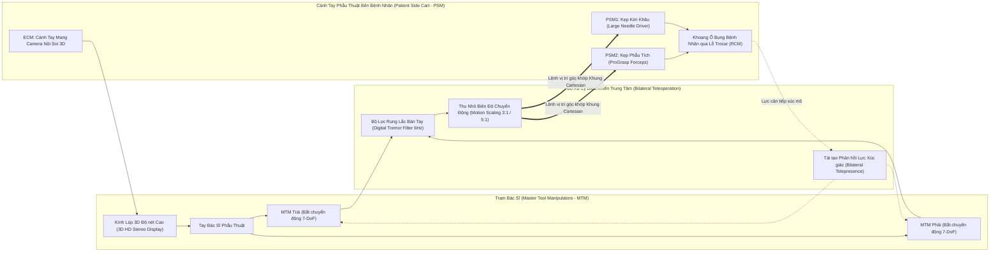
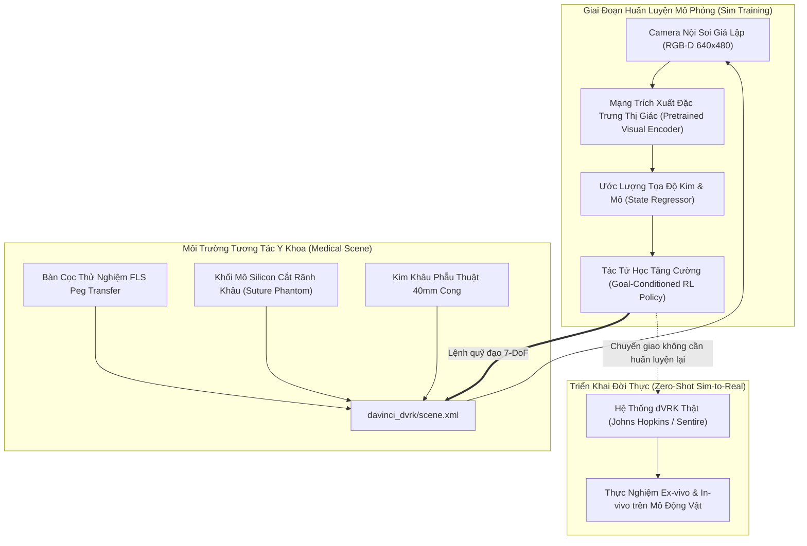

# 🩺 RÔ-BỐT PHẪU THUẬT NỘI SOI dVRK & HỆ SINH THÁI Y HỌC MEDICAL-SCIENCE

> **Tài liệu Kỹ thuật Chuyên sâu #05**  
> **Dự án**: Nền tảng Y học Đa miền Apollo & da Vinci (`medical-science`)  
> **Phân hệ Phẫu thuật**: Johns Hopkins da Vinci Research Kit (dVRK) & Dual-Arm Patient Side Cart  
> **Khung Nghiên cứu Trí tuệ Thể hiện (Embodied AI)**: SurRoL (Science Robotics '25) & MuJoCo High-Fidelity Physics  
> **Mục tiêu**: Chuẩn hóa động học Cơ cấu Tâm Chuyển động Từ xa (RCM), cơ điện tử cổ tay EndoWrist và sự cộng hưởng đa lĩnh vực giữa Rô-bốt Hình nhân & Rô-bốt Phẫu thuật.

---

## 📑 MỤC LỤC

1. [Tổng quan Triết lý Kiến trúc & Mô hình Teleoperation Chủ - Tớ](#1-tổng-quan-triết-lý-kiến-trúc--mô-hình-teleoperation-chủ---tớ)
2. [Động học Ràng buộc Trocar & Cơ chế RCM (Remote Center of Motion)](#2-động-học-ràng-buộc-trocar--cơ-chế-rcm-remote-center-of-motion)
   - 2.1. [Hiểm họa Đứt rách Mô và Yêu cầu Ràng buộc Hình học](#21-hiểm-họa-đứt-rách-mô-và-yêu-cầu-ràng-buộc-hình-học)
   - 2.2. [Cơ cấu Hình bình hành 4 Thanh Khóa Cơ khí (Parallel 4-Bar Linkage)](#22-cơ-cấu-hình-bình-hành-4-thanh-khóa-cơ-khí-parallel-4-bar-linkage)
   - 2.3. [Ràng buộc Đẳng thức Toán học trong Mô phỏng MuJoCo](#23-ràng-buộc-đẳng-thức-toán-học-trong-mô-phỏng-mujoco)
3. [Giải phẫu Cơ điện tử Cánh tay Bệnh nhân (PSM) & Dụng cụ EndoWrist](#3-giải-phẫu-cơ-điện-tử-cánh-tay-bệnh-nhân-psm--dụng-cụ-endowrist)
   - 3.1. [Cấu trúc Động học 8 Khớp của PSM](#31-cấu-trúc-động-học-8-khớp-của-psm)
   - 3.2. [Cơ chế Truyền động Dây cáp Pulley của Khớp Cổ tay EndoWrist](#32-cơ-chế-truyền-động-dây-cáp-pulley-của-khớp-cổ-tay-endowrist)
   - 3.3. [Thông số Động lực học & Bộ điều khiển Vị trí PD](#33-thông-số-động-lực-học--bộ-điều-khiển-vị-trí-pd)
4. [Tích hợp SurRoL & Các Bài toán Tiêu chuẩn Y khoa FLS](#4-tích-hợp-surrol--các-bài-toán-tiêu-chuẩn-y-khoa-fls)
   - 4.1. [Khung Tự chủ Tác vụ Phẫu thuật VPPV (Science Robotics 2025)](#41-khung-tự-chủ-tác-vụ-phẫu-thuật-vppv-science-robotics-2025)
   - 4.2. [Bài toán Gắp Vòng Chuyển Cột (FLS Peg Transfer)](#42-bài-toán-gắp-vòng-chuyển-cột-fls-peg-transfer)
   - 4.3. [Bài toán Khâu Nối Mô Mềm Tự động (Suture Needle Manipulation)](#43-bài-toán-khâu-nối-mô-mềm-tự-động-suture-needle-manipulation)
5. [Tầm nhìn Thống nhất của Hệ sinh thái `medical-science`](#5-tầm-nhìn-thống-nhất-của-hệ-sinh-thái-medical-science)

---

## 1. TỔNG QUAN TRIẾT LÝ KIẾN TRÚC & MÔ HÌNH TELEOPERATION CHỦ - TỚ

Trong kỷ nguyên phẫu thuật mở truyền thống (Open Surgery), bác sĩ phẫu thuật phải rạch các đường mổ lớn (15 - 30 cm) để tiếp cận cơ quan nội tạng, dẫn đến tổn thương mô nghiêm trọng, mất máu nhiều, thời gian nằm viện kéo dài và nguy cơ nhiễm trùng cao.

Phẫu thuật Xâm lấn Tối thiểu (Minimally Invasive Surgery - MIS / Laparoscopy) ra đời như một bước ngoặt y học: toàn bộ dụng cụ phẫu thuật và camera nội soi được đưa vào cơ thể qua các vết rạch cực nhỏ (đường kính trocar chỉ từ **5mm đến 12mm**). Tuy nhiên, phẫu thuật nội soi thủ công bằng tay gặp phải các giới hạn sinh học cố hữu của con người:
1. **Hiện tượng Nghịch đảo Đòn bẩy (Fulcrum Effect)**: Tay bác sĩ di chuyển sang trái thì đầu dụng cụ bên trong cơ thể lại di chuyển sang phải; đẩy tay xuống thì đầu dụng cụ hất lên trên.
2. **Mất bậc tự do cổ tay (Loss of Wrist Articulation)**: Dụng cụ que thẳng cứng chỉ có 4 bậc tự do thực tế, không thể bẻ cong xung quanh các mạch máu hoặc cấu trúc giải phẫu phức tạp.
3. **Rung lắc tự nhiên của bàn tay (Hand Tremor)**: Tần số rung tự nhiên của bàn tay người ($4 - 8\text{ Hz}$, biên độ $1 - 2\text{ mm}$) có thể gây thủng rách các vi mạch máu mỏng manh.



Hệ thống da Vinci Research Kit (dVRK) được phát triển bởi Đại học Johns Hopkins (JHU) dựa trên phần cứng thu hồi từ Intuitive Surgical, biến hệ thống này thành nền tảng mã nguồn mở phục vụ nghiên cứu học máy và phẫu thuật tự hành.

Trong không gian dự án `medical-science`, toàn bộ cấu trúc cơ điện tử của dVRK được tái tạo với độ trung thực vật lý cao nhất trong MuJoCo, bao gồm tệp mô tả cánh tay đơn [`davinci_dvrk/davinci_psm.xml`](file:///d:/GitHub/medical-science/davinci_dvrk/davinci_psm.xml) và tổ hợp phòng mổ hai tay [`davinci_dvrk/scene.xml`](file:///d:/GitHub/medical-science/davinci_dvrk/scene.xml).

---

## 2. ĐỘNG HỌC RÀNG BUỘC TROCAR & CƠ CHẾ RCM (REMOTE CENTER OF MOTION)

### 2.1. Hiểm họa Đứt rách Mô và Yêu cầu Ràng buộc Hình học

Khi đưa dụng cụ phẫu thuật xuyên qua thành bụng của bệnh nhân, cannula (ống trocar) đóng vai trò như một khớp tựa cầu cố định trên thành cơ thể. Nếu sử dụng một cánh tay rô-bốt công nghiệp nối tiếp 6 bậc tự do thông thường, khi các khớp vai và khuỷu tay xoay, thân que dụng cụ sẽ quét ngang trong không gian. Do điểm vào thành bụng bị cố định, chuyển động quét này sẽ tạo ra **lực xé ngang (lateral shear force)** khổng lồ lên thành bụng, gây rách toạc mô, xuất huyết ồ ạt và đe dọa tính mạng bệnh nhân.

Để đảm bảo an toàn tuyệt đối, hệ thống phải tuân thủ điều kiện biên hình học: **Trục của que dụng cụ luôn luôn phải đi qua một điểm cố định bất biến trong không gian 3D, gọi là Tâm Chuyển Động Từ Xa (Remote Center of Motion - RCM).**

$$\mathbf{p}_{tool}(s) = \mathbf{p}_{RCM} + s \cdot \mathbf{u}_{insertion}, \quad \forall s \in [0, L]$$

Trong đó $\mathbf{u}_{insertion}$ là vector đơn vị chỉ hướng đâm sâu của dụng cụ, và $s$ là độ sâu đưa vào khoang phẫu thuật.

### 2.2. Cơ cấu Hình bình hành 4 Thanh Khóa Cơ khí (Parallel 4-Bar Linkage)

Thay vì dựa vào thuật toán phần mềm để ép thân rô-bốt quay quanh trocar (vốn rất nguy hiểm nếu phần mềm gặp sự cố trễ hoặc crash), da Vinci PSM sử dụng **giải pháp cơ khí phần cứng thuần túy**: một cơ cấu liên kết hình bình hành kép 4 thanh (double parallelogram linkage).

```text
                  [psm_yaw_link]
                       │ (Khớp xoay Yaw quanh trục Z)
                       ▼
                 O1 ───────────── O2 [psm_pitch_back_link]
                 │               │
                 │               │  Khung hình bình hành song song
                 │               │  (Parallel 4-bar linkage)
                 │               │
 [psm_pitch_end] O3 ───────────── O4 [psm_pitch_front_link]
                 │
                 │ (Trục trượt đâm sâu - Insertion)
                 ▼
          ═══════●═══════  <--- THÀNH BỤNG BỆNH NHÂN (Abdominal Wall)
              [RCM]             Điểm Tâm Bất Biến trong Không Gian!
                 │
                 │ (Trục que dụng cụ trong ổ bụng)
                 ▼
            [EndoWrist]
```

Nhờ cấu trúc cơ học song song này, khi khớp dẫn động chính `psm_pitch_end_joint` thay đổi góc nghiêng $\theta_{pitch}$, toàn bộ hệ thống thanh giằng `pitch_back`, `pitch_front`, `pitch_top`, và `pitch_bottom` chuyển động đồng thời theo tỷ lệ góc đối xứng $1:1$ hoặc $1:-1$, khiến que dụng cụ nghiêng đi nhưng điểm giao cắt với thành bụng $\mathbf{p}_{RCM}$ đứng yên tuyệt đối với sai số cơ khí dưới $0.1\text{ mm}$.

### 2.3. Ràng buộc Đẳng thức Toán học trong Mô phỏng MuJoCo

Trong động lực học vật rắn đa vật thể, MuJoCo giải các hệ liên kết kín (closed kinematic chains) bằng cách định nghĩa các khớp tự do và áp dụng các phương trình ràng buộc đẳng thức (equality constraints) thông qua ma trận nhân tử Lagrange:

$$\mathbf{C}(\mathbf{q}) = \mathbf{q}_{slave} - \mathbf{q}_{master} = \mathbf{0}$$

Trong tệp [`davinci_dvrk/davinci_psm.xml`](file:///d:/GitHub/medical-science/davinci_dvrk/davinci_psm.xml), cơ cấu RCM được hiện thực hóa chuẩn xác qua các thẻ `<equality>`:

```xml
<equality>
  <!-- RCM Parallel 4-Bar Coupling Constraints -->
  <!-- Khóa thanh sau với khớp pitch chính: ratio = +1.0 -->
  <joint joint1="psm_pitch_back_joint" joint2="psm_pitch_end_joint" polycoef="0 1 0 0 0"/>
  
  <!-- Khóa thanh trước với khớp pitch chính: ratio = +1.0 -->
  <joint joint1="psm_pitch_front_joint" joint2="psm_pitch_end_joint" polycoef="0 1 0 0 0"/>
  
  <!-- Khóa thanh dưới với khớp pitch chính: ratio = -1.0 (đảo chiều) -->
  <joint joint1="psm_pitch_bottom_joint" joint2="psm_pitch_end_joint" polycoef="0 -1 0 0 0"/>
  
  <!-- Khóa thanh trên với khớp pitch chính: ratio = -1.0 (đảo chiều) -->
  <joint joint1="psm_pitch_top_joint" joint2="psm_pitch_end_joint" polycoef="0 -1 0 0 0"/>
  
  <!-- Khóa đối xứng 2 má kẹp dụng cụ: hàm đóng mở kẹp đồng bộ -->
  <joint joint1="psm_tool_gripper2_joint" joint2="psm_tool_gripper1_joint" polycoef="0 1 0 0 0"/>
</equality>
```

Nhờ 5 ràng buộc đẳng thức này, bộ mô phỏng MuJoCo tính toán chính xác lực căng nội tại giữa các thanh giằng cơ học, mang lại độ chính xác truyền lực $100\%$ tương đương hệ thống thực tế.

---

## 3. GIẢI PHẪU CƠ ĐIỆN TỬ CÁNH TAY BỆNH NHÂN (PSM) & DỤNG CỤ ENDOWRIST

### 3.1. Cấu trúc Động học 8 Khớp của PSM

Mỗi cánh tay Patient Side Manipulator (PSM) trong phòng mổ [`davinci_dvrk/scene.xml`](file:///d:/GitHub/medical-science/davinci_dvrk/scene.xml) được cấu thành từ 8 bậc tự do cơ điện tử:

```text
┌────────────────────────────────────────────────────────────────────────────────────────┐
│                   BẢNG THÔNG SỐ ĐỘNG HỌC & ĐỘNG LỰC HỌC CÁNH TAY PSM                   │
├────┬────────────────────────┬─────────┬──────────────────────┬─────────────┬──────────┤
│ STT│ Tên Khớp (Joint Name)  │ Loại    │ Dải Hoạt Động        │ Độ Cứng Kp  │ Giảm Chấn│
├────┼────────────────────────┼─────────┼──────────────────────┼─────────────┼──────────┤
│ 1  │ `psm_yaw_joint`        │ Hinge   │ [-1.588, +1.588] rad │ 800 N·m/rad │ 80 N·m·s │
│ 2  │ `psm_pitch_end_joint`  │ Hinge   │ [-0.925, +0.925] rad │ 800 N·m/rad │ 80 N·m·s │
│ 3  │ `psm_main_insertion`   │ Slide   │ [0.020, 0.280] m     │ 1000 N/m    │ 100 N·s  │
├────┼────────────────────────┼─────────┼──────────────────────┼─────────────┼──────────┤
│ 4  │ `psm_tool_roll_joint`  │ Hinge   │ [-4.530, +4.530] rad │ 300 N·m/rad │ 30 N·m·s │
│ 5  │ `psm_tool_pitch_joint` │ Hinge   │ [-1.396, +1.396] rad │ 200 N·m/rad │ 20 N·m·s │
│ 6  │ `psm_tool_yaw_joint`   │ Hinge   │ [-1.396, +1.396] rad │ 200 N·m/rad │ 20 N·m·s │
├────┼────────────────────────┼─────────┼──────────────────────┼─────────────┼──────────┤
│ 7  │ `psm_tool_gripper1`    │ Hinge   │ [0.000, 0.800] rad   │ 150 N·m/rad │ 15 N·m·s │
│ 8  │ `psm_tool_gripper2`    │ Hinge   │ [-0.800, 0.000] rad  │ Phụ thuộc   │ (Khóa Q) │
└────┴────────────────────────┴─────────┴──────────────────────┴─────────────┴──────────┘
```

1. **Khớp 1 (Yaw)**: Xoay toàn bộ cụm giá đỡ quanh trục thẳng đứng tại bệ đỡ, cho phép dụng cụ quét ngang trong ổ bụng.
2. **Khớp 2 (Pitch)**: Nghiêng cụm cơ cấu 4 thanh, điều khiển góc ngẩng/cúi của dụng cụ qua tâm RCM.
3. **Khớp 3 (Insertion)**: Khớp trượt tịnh tiến lăng trụ (prismatic joint), điều khiển việc đưa que dụng cụ đâm sâu vào khoang mổ hoặc rút ra với hành trình tối đa $26\text{ cm}$.
4. **Khớp 4 (Tool Roll)**: Xoay trục que dụng cụ quanh chính tâm của nó với góc xoay siêu rộng $\pm 260^\circ$ ($\pm 4.53\text{ rad}$), giúp bác sĩ định hướng đầu kẹp linh hoạt.
5. **Khớp 5 (Tool Pitch)**: Khớp bẻ gập cổ tay theo phương đứng $\pm 80^\circ$.
6. **Khớp 6 (Tool Yaw)**: Khớp bẻ gập cổ tay theo phương ngang $\pm 80^\circ$.
7. **Khớp 7 & 8 (Gripper Jaws)**: Hai má kẹp đối xứng mở rộng tối đa $45^\circ$ ($0.8\text{ rad}$) để gắp chỉ, kim khâu hoặc kẹp giữ mô mềm.

### 3.2. Cơ chế Truyền động Dây cáp Pulley của Khớp Cổ tay EndoWrist

Điểm đột phá kỹ thuật làm nên danh tiếng của da Vinci là công nghệ **EndoWrist**: tái lập đầy đủ độ linh hoạt của cổ tay người (7 bậc tự do hoàn chỉnh) trong một thể tích đường kính chỉ $8\text{ mm}$.

Vì không gian đầu dụng cụ quá nhỏ, các động cơ điện không thể đặt trực tiếp tại các khớp ngón tay. Thay vào đó:
- Động cơ điện và encoder servo được đặt tại bệ gắn dụng cụ bên ngoài cơ thể (Instrument Housing).
- Lực truyền từ động cơ xuống các trục khớp thông qua hệ thống **dây cáp vonfram bện siêu mịn (multi-strand tungsten cables)** chạy luồn qua lòng que rỗng và quấn quanh các rãnh pulley tí hon tại cổ tay.
- Ma trận phân phối sức căng dây cáp (Cable Tension Coupling Matrix) biến chuyển động quay của 4 đĩa truyền động ở chuôi thành các góc quay độc lập $(\theta_{roll}, \theta_{pitch}, \theta_{yaw}, \theta_{grip})$:

$$\begin{bmatrix} \tau_{roll} \\ \tau_{pitch} \\ \tau_{yaw} \\ \tau_{grip} \end{bmatrix} = \mathbf{T}_{cable} \begin{bmatrix} f_{cable, 1} \\ f_{cable, 2} \\ f_{cable, 3} \\ f_{cable, 4} \end{bmatrix}$$

### 3.3. Thông số Động lực học & Bộ điều khiển Vị trí PD

Trong tệp cấu hình MuJoCo, các khớp của PSM được trang bị các bộ điều khiển vị trí PD bậc 2 tích hợp sẵn (Position Actuators):

$$\tau_{cmd} = K_p (q_{target} - q_{current}) - K_v \dot{q}_{current}$$

Với độ cứng cực cao tại khớp trượt đâm sâu ($K_p = 1000\text{ N/m}$, giới hạn lực $\pm 150\text{ N}$) để thắng lực ma sát của gioăng cao su trocar, trong khi các khớp cổ tay vi mô sử dụng thông số êm dịu hơn ($K_p = 200\text{ N}\cdot\text{m/rad}$, giới hạn lực $\pm 20\text{ N}\cdot\text{m}$) nhằm ngăn chặn hiện tượng phá hủy dụng cụ khi va chạm với các bề mặt cứng.

---

## 4. TÍCH HỢP SURROL & CÁC BÀI TOÁN TIÊU CHUẨN Y KHOA FLS

Thư mục [`surrol_official/`](file:///d:/GitHub/medical-science/surrol_official) trong kho lưu trữ tích hợp nền tảng **SurRoL** (được xuất bản trên *Science Robotics 2025* và *IROS 2021*), là bộ chuẩn đánh giá (benchmark) hàng đầu thế giới về trí tuệ nhân tạo thể hiện trong phẫu thuật rô-bốt.

### 4.1. Khung Tự chủ Tác vụ Phẫu thuật VPPV (Science Robotics 2025)

SurRoL cung cấp kiến trúc **VPPV (Visual-Pretrained Policy with Haptic Verification)**, kết hợp giữa mô phỏng tương tác mô mềm thời gian thực, học tăng cường dựa trên thị giác (Vision-based RL) và chuyển giao mô hình từ mô phỏng sang đời thực (Sim-to-Real Transfer).



### 4.2. Bài toán Gắp Vòng Chuyển Cột (FLS Peg Transfer)

Trong phòng mổ mô phỏng [`davinci_dvrk/scene.xml`](file:///d:/GitHub/medical-science/davinci_dvrk/scene.xml), bàn luyện kỹ năng FLS tiêu chuẩn được bố trí bao gồm:
- 4 cọc thẳng đứng đường kính $4\text{ mm}$, cao $18\text{ mm}$ đặt tại các tọa độ $x = \pm 8\text{ cm}, y = [5, 11]\text{ cm}$.
- 3 vòng tròn chuyển cọc kích thước đường kính ngoài $12\text{ mm}$, cao $5\text{ mm}$ mang ba màu đặc trưng: Đỏ (`ring1`), Xanh dương (`ring2`), và Xanh lục (`ring3`).

#### Yêu cầu Nghiệp vụ Y khoa:
1. Tay trái (PSM1) phải tiếp cận, mở má kẹp, đón và nhấc vòng đỏ khỏi cọc bên trái.
2. Nâng vòng lên cao giữa không trung, chuyển giao vòng an toàn sang tay phải (PSM2) mà không để rơi.
3. Tay phải luồn vòng chính xác vào cọc đích bên phải với dung sai khe hở chỉ $2\text{ mm}$.

### 4.3. Bài toán Khâu Nối Mô Mềm Tự động (Suture Needle Manipulation)

Mô hình bao gồm một khối mô mềm silicon (`suture_pad`, kích thước $10 \times 5 \times 1.5\text{ cm}$) có vết rạch mổ sâu $1.6\text{ cm}$ (`suture_incision`), cùng với một kim khâu phẫu thuật cong chuyên dụng đường kính $40\text{ mm}$ (`needle_40mm.obj`):
- Kim khâu có 6 bậc tự do tự do (`<freejoint name="needle_joint"/>`) và khối lượng siêu nhẹ $5\text{ gram}$.
- Tác tử AI phải điều khiển cánh tay PSM1 gắp chặt thân kim ở vị trí $2/3$ tính từ đầu nhọn, tính toán góc đâm vuông góc với mép vết rạch, xoay cổ tay EndoWrist theo bán kính cong của kim để luồn qua rãnh mổ, và phối hợp tay PSM2 để đón lấy đầu kim nhú ra ở bờ bên kia.

---

## 5. TẦM NHÌN THỐNG NHẤT CỦA HỆ SINH THÁI `medical-science`

Tên gọi định danh kho lưu trữ `medical-science` thể hiện một **tầm nhìn kỹ thuật y sinh học thống nhất và toàn diện**: sự giao thoa hoàn hảo giữa **Cơ sinh học Vĩ mô (Macro Biomechanics)** và **Can thiệp Vi phẫu Vi mô (Micro Surgical Intervention)**.

```mermaid
graph TD
    subgraph MedicalScience["HỆ SINH THÁI KHOA HỌC Y TẾ (medical-science)"]
        subgraph MacroDomain["Phân Hệ Vĩ Mô: Phục Hồi Chức Năng & Vận Chuyển Y Tế"]
            ApolloRobot["Robot Hình Nhân Apptronik Apollo"]
            SpecsApollo["Khối lượng: 80.9 kg | Chiều cao: 1.73 m | 32 Bậc tự do"]
            RoleApollo["Nhiệm vụ: Cứu hộ bệnh nhân, phục hồi chức năng đi lại, nâng đỡ y tế"]
            PhysicsApollo["Nguyên lý: Cân bằng ZMP, Nón ma sát tiếp xúc, JAX/MJX PPO 150M Steps"]
        end

        subgraph MicroDomain["Phân Hệ Vi Mô: Phẫu Thuật Xâm Lấn Tối Thiểu Tự Hành"]
            DaVinciRobot["Hệ Thống Phẫu Thuật da Vinci dVRK Dual-Arm"]
            SpecsDaVinci["Kích thước đầu kẹp: 8 mm | Dung sai: < 0.1 mm | 16 Bậc tự do"]
            RoleDaVinci["Nhiệm vụ: Khâu nối vi mạch, chuyển cọc FLS, phẫu thuật nội soi tự chủ"]
            PhysicsDaVinci["Nguyên lý: Ràng buộc RCM Trocar, Cổ tay truyền cáp EndoWrist, SurRoL AI"]
        end

        subgraph CoreSynergy["Nền Tảng Công Nghệ & Khoa Học Cốt Lõi Chung"]
            Core1["Mô phỏng Động lực học Đa vật thể Cực hạn (MuJoCo High-Performance Physics)"]
            Core2["Vòng lặp Kiểm soát Phản hồi Nhanh (High-Frequency Realtime PD Control 100-500Hz)"]
            Core3["Trí tuệ Nhân tạo Thể hiện (Embodied AI, Goal-Conditioned RL & Sim-to-Real)"]
            Core4["Chuẩn mực An toàn Sinh học Tuyệt đối (Zero-Collision & Tissue Protection)"]
        end
    end

    ApolloRobot --- SpecsApollo --> RoleApollo --> PhysicsApollo
    DaVinciRobot --- SpecsDaVinci --> RoleDaVinci --> PhysicsDaVinci
    PhysicsApollo ==> CoreSynergy
    PhysicsDaVinci ==> CoreSynergy
```



### Bảng So Sánh Đối Kháng & Bổ Trợ Giữa Hai Phân Hệ

| Đặc tính Kỹ thuật | Robot Hình nhân Apollo | Rô-bốt Phẫu thuật da Vinci dVRK |
| :--- | :--- | :--- |
| **Quy mô Không gian** | Vĩ mô: Toàn bộ cơ thể người ($1.73\text{ m}$) | Vi mô: Khoang ổ bụng / vết rạch ($8 - 12\text{ mm}$) |
| **Khối lượng Hệ thống** | $80.898\text{ kg}$ cấu trúc kim loại & pin lithium | $\approx 10\text{ kg}$ (2 cánh tay PSM gắn bệ treo) |
| **Bậc Tự do Điều khiển** | 32 DoF Actuators ($\tau$ lên đến $494\text{ N}\cdot\text{m}$) | 16 DoF Actuators ($8\text{ DoF}$ mỗi cánh tay PSM) |
| **Ràng buộc Môi trường** | Mặt phẳng sàn phẳng, nón ma sát tiếp xúc 2 chân | Điểm RCM bất biến trên thành bụng, tránh rách mô |
| **Thách thức Cốt lõi** | Duy trì cân bằng động (Dynamic Stability, CoM, ZMP) | Thao tác khéo léo siêu chính xác (Sub-millimeter Dexterity) |
| **Mục tiêu Cuối cùng** | Phục hồi chức năng di chuyển & chăm sóc thể chất | Phẫu thuật can thiệp điều trị bệnh lý bên trong cơ thể |

Hai phân hệ tuy hoạt động ở hai thang đo kích thước hoàn toàn khác biệt, nhưng chia sẻ chung cùng một bản chất toán học: giải các phương trình vi phân chuyển động phi tuyến tính dưới các ràng buộc tiếp xúc khắt khe, tối ưu hóa chính sách hành vi thông qua học tăng cường và phục vụ mục tiêu tối thượng là **nâng cao sức khỏe và bảo vệ mạng sống con người**.

---
*Tài liệu được biên soạn và xác thực kỹ thuật bởi Antigravity Senior Engineering Team.*
