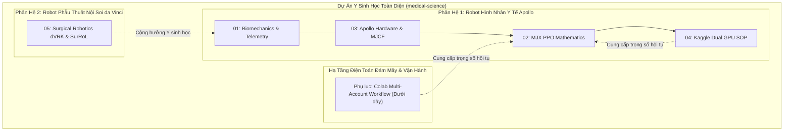

# 📚 BỘ TÀI LIỆU KỸ THUẬT CHUYÊN SÂU DỰ ÁN MEDICAL-SCIENCE

## (Medical-Science Master Technical Documentation Suite)

> **Dự án**: Nền tảng Robot Y học Đa miền Apollo & da Vinci (`medical-science`)  
> **Cơ quan phát triển & Bản quyền**: Antigravity Senior Engineering Team  
> **Kho lưu trữ**: `d:\GitHub\medical-science\docx\`

---

## 🧭 MỤC LỤC TỔNG THỂ CÁC TẬP TÀI LIỆU CHUYÊN SÂU

Kho tài liệu chuyên sâu `docx/` được thiết kế theo tiêu chuẩn công bố khoa học quốc tế (IEEE / Science Robotics standard), phân tách thành các tập tài liệu độc lập, hoàn chỉnh với đầy đủ công thức giải tích, sơ đồ kiến trúc Mermaid và dữ liệu thực chứng:

| Tập Tài Liệu | Tên Tài Liệu Kỹ Thuật | Phân Hệ & Lĩnh Vực Cốt Lõi | Định Dạng |
| :---: | :--- | :--- | :---: |
| **01** | [**Biomechanics Theory & Telemetry**](file:///d:/GitHub/medical-science/docx/01_BIOMECHANICS_THEORY_AND_TELEMETRY.md) | Cơ sinh học đi bộ, Tâm áp lực ZMP Vukobratovic, Nón ma sát tiếp xúc Coulomb, Đa giác hỗ trợ lồi và Dao động ký 4 kênh viễn trắc OpenGL | Markdown (`.md`) |
| **02** | [**MJX PPO Reinforcement Learning Mathematics**](file:///d:/GitHub/medical-science/docx/02_MJX_PPO_REINFORCEMENT_LEARNING_MATHEMATICS.md) | Nền tảng Toán học MDP 105D/114D, Hàm mất mát PPO Clipped Surrogate, Ước lượng Lợi thế Khái quát GAE-λ, 9 thành phần Hàm thưởng và Tự động Reset VRAM trên JAX | Markdown (`.md`) |
| **03** | [**Apptronik Apollo Hardware & Physics Model**](file:///d:/GitHub/medical-science/docx/03_APPTRONIK_APOLLO_HARDWARE_AND_PHYSICS_MODEL.md) | Giải phẫu 37 vật thể rắn MJCF ($80.898\text{ kg}$), 32 cơ cấu chấp hành ($\tau_{max} = \pm 494\text{ N}\cdot\text{m}$), 80 hình học va chạm và Động học tư thế đứng chuẩn ($Z = 1.016\text{ m}$) | Markdown (`.md`) |
| **04** | [**Kaggle Dual GPU Training & Deployment SOP**](file:///d:/GitHub/medical-science/docx/04_KAGGLE_DUAL_GPU_TRAINING_AND_DEPLOYMENT_SOP.md) | Quy trình Vận hành Tiêu chuẩn (SOP) Kaggle Dual Tesla T4 (32GB VRAM), JAX/XLA SPMD phân tán, Giáo trình Vận tốc & Ngoại lực xô đẩy, Checkpoint REST API | Markdown (`.md`) |
| **05** | [**Surgical Robotics dVRK & Medical Science**](file:///d:/GitHub/medical-science/docx/05_SURGICAL_ROBOTICS_DVRK_AND_MEDICAL_SCIENCE.md) | Rô-bốt Phẫu thuật da Vinci Research Kit (dVRK), Động học Tâm chuyển động từ xa RCM 4 thanh song song, Cổ tay cáp kéo EndoWrist 7-DoF, SurRoL và Tầm nhìn Thống nhất | Markdown (`.md`) |
| **Phụ lục** | [**Google Colab Automated Multi-Account Workflow**](#-hướng-dẫn-quy-trình--kiến-trúc-huấn-luyện-google-colab) | Hướng dẫn Kiến trúc Hạ tầng Đám mây Google Colab Đa tài khoản, Tự động vượt Quota Failover, Viễn trắc HTTP REST API và Khắc phục sự cố *(Nội dung chi tiết bên dưới)* | Tài liệu gốc |

---



---

## 🚀 HƯỚNG DẪN QUY TRÌNH & KIẾN TRÚC HUẤN LUYỆN GOOGLE COLAB

### (Google Colab Automated Multi-Account Cloud Training Workflow)

> **Dự án**: Robot Hình nhân Y học Apollo (`medical-science`)  
> **Mục tiêu tài liệu**: Chuẩn hóa toàn bộ kiến trúc đám mây, cơ chế xoay vòng tài khoản, tự động vượt hạn mức GPU (Quota Bypass / Failover), giám sát không nghẽn qua HTTP REST API và quy trình vận hành tiêu chuẩn (SOP) dành cho **AI Assistant trong các phiên làm việc mới** và **Kỹ sư phụ trách hệ thống**.

---

## 📑 MỤC LỤC PHẦN HẠ TẦNG COLAB

1. [Tổng quan Kiến trúc & Nguyên lý Thiết kế](#1-tổng-quan-kiến-trúc--nguyên-lý-thiết-kế)
2. [Bản đồ Thành phần & Cấu trúc Thư mục](#2-bản-đồ-thành-phần--cấu-trúc-thư-mục)
3. [Cơ chế Xác thực & Quản trị Hồ bơi Tài khoản (Account Pool)](#3-cơ-chế-xác-thực--quản-trị-hồ-bơi-tài-khoản-account-pool)
4. [Vòng đời Cấp phát Máy ảo & Khởi chạy Huấn luyện (GPU Lifecycle)](#4-vòng-đời-cấp-phát-máy-ảo--khởi-chạy-huấn-luyện-gpu-lifecycle)
5. [Giám sát Thời gian Thực & Cơ chế Viễn trắc REST (Telemetry)](#5-giám-sát-thời-gian-thực--cơ-chế-viễn-trắc-rest-telemetry)
6. [Chiến lược Checkpointing & Chuyển giao Tự động (Failover & Resume)](#6-chiến-lược-checkpointing--chuyển-giao-tự-động-failover--resume)
7. [Quy trình Vận hành Tiêu chuẩn dành cho AI (AI SOP)](#7-quy-trình-vận-hành-tiêu-chuẩn-dành-cho-ai-ai-sop)
8. [Ma trận Xử lý Sự cố Thường gặp (Troubleshooting & Remediation)](#8-ma-trận-xử-lý-sự-cố-thường-gặp-troubleshooting--remediation)

---

## 1. TỔNG QUAN KIẾN TRÚC & NGUYÊN LÝ THIẾT KẾ

### 1.1. Thách thức Thực tế khi Huấn luyện RL trên Google Colab

Huấn luyện Học tăng cường (Reinforcement Learning - PPO/MJX) quy mô lớn (hơn 150 triệu bước với 8.192 môi trường song song) trên tài nguyên GPU miễn phí của Google Colab đặt ra các giới hạn kỹ thuật khắc nghiệt:

- **Giới hạn thời gian sống máy ảo (Timeout)**: Máy ảo Colab bị thu hồi sau 12 tiếng hoặc bị ngắt khi không có tương tác người dùng.
- **Hạn mức GPU (GPU Quota Limit)**: Khi đạt ngưỡng sử dụng, Google ngắt phiên và trả về lỗi `503 Service Unavailable / outcome: 2` (Cooldown thường kéo dài 8-12 tiếng).
- **Hiện tượng treo kênh WebSocket (Jupyter Kernel Freeze)**: Khi GPU chạy 100% tải với trình biên dịch JAX/XLA, việc gửi lệnh shell qua WebSocket (`colab exec`) thường xuyên bị timeout hoặc treo toàn bộ client.
- **Lỗi hết hạn Token (Token Expiry)**: Cả Google OAuth Access Token và Runtime Proxy Token đều tự động hết hạn sau 3.600 giây (1 tiếng).
- **Ràng buộc môi trường lưu trữ tạm thời (Ephemeral Storage)**: Khi máy ảo bị thu hồi, toàn bộ dữ liệu trên thư mục `/content/` sẽ bị xóa vĩnh viễn.

### 1.2. Giải pháp Kiến trúc Cốt lõi của Dự án

```text
                                  ┌────────────────────────────────────────────────────────┐
                                  │           GITHUB REPOSITORY (CENTRAL BUS)              │
                                  │  - Model Weights (.npz)    - Master train.log          │
                                  │  - checkpoint_history.md   - checkpoint_history.csv    │
                                  └──────────────────────────┬─────────────────────────────┘
                                                             │
                                        Git Pull / Git Push  │  Dynamically Injected
                                        (Rebase -Xtheirs)    │  GITHUB_TOKEN
                                                             ▼
┌──────────────────────────────────────────────────────────────────────────────────────────┐
│                   ORCHESTRATOR / HOST RELAY (Local hoặc GitHub Actions)                  │
│  [training/colab_relay.py]                                                               │
│    ├── 1. colab_pool.py: Quản lý 5 tài khoản Google (account_1 -> account_5)             │
│    ├── 2. Auto-purge CPU VMs: Giải phóng máy ảo CPU để cấp phát GPU T4                    │
│    ├── 3. Proactive Auth Refresh: Tự động gia hạn OAuth token & Proxy token mỗi 10 phút  │
│    ├── 4. REST ContentsClient: Đọc log & tải .npz qua Google HTTP REST API (~0.2s)       │
│    └── 5. Deduplicated Stream: Stream log không lặp dòng theo Giờ Việt Nam (UTC+7)       │
└──────────────────────────────┬─────────────────────────────▲─────────────────────────────┘
                               │                             │
          Provision GPU & Run  │                             │ Non-blocking REST Polling
          Nohup Daemon         │                             │ (Bypass WebSocket)
                               ▼                             │
┌────────────────────────────────────────────────────────────┴─────────────────────────────┐
│                       GOOGLE COLAB GPU RUNTIME (Tesla T4 / L4)                           │
│  [colab_deploy/train_stage2.py] (Nohup Background Process)                               │
│    ├── JAX / MJX PPO: 8,192 Envs song song | XLA Triton GEMM | Latency Hiding Scheduler  │
│    ├── File: /content/train.log                                                          │
│    ├── Rotating Checkpoint: /content/checkpoints/apollo_stage2_v2_latest.npz             │
│    └── Internal Sync: Commit & push lên GitHub định kỳ mỗi 24 vòng lặp (~12.5M steps)    │
└──────────────────────────────────────────────────────────────────────────────────────────┘
```

#### Các nguyên lý trụ cột

1. **GitHub làm Bus dữ liệu tập trung (Central State Bus)**: Không sử dụng Google Drive mount (vì Drive mount phụ thuộc tài khoản đơn lẻ, dễ lỗi quota I/O và đòi hỏi tương tác thủ công). Toàn bộ checkpoint, lịch sử huấn luyện và nhật ký đều được cam kết tự động vào Git repository với cờ `[skip ci]`.
2. **Hồ bơi Đa tài khoản Xoay vòng (Multi-Account Pool Relay)**: Duy trì một nhóm 5 tài khoản Google độc lập. Khi một tài khoản chạm hạn mức GPU, hệ thống lập tức bàn giao sang tài khoản tiếp theo trong danh sách, tải checkpoint mới nhất từ GitHub về và tiếp tục huấn luyện với tham số `--resume`.
3. **Giám sát Viễn trắc qua HTTP REST API (Bypass WebSocket)**: Sử dụng lớp `ContentsClient` của Google Colab API để truy xuất trực tiếp các tệp `train.log` và checkpoint nhị phân `.npz`. Thao tác này là giao thức HTTP GET đơn thuần, phản hồi trong 0.2 giây và không bao giờ bị nghẽn bởi tải tính toán GPU.
4. **Tự chữa lành xác thực (Proactive Self-Healing Auth)**: Cứ mỗi 10 phút, hệ thống chủ động gọi `Credentials.refresh()` cho OAuth token và gọi Google Colab Control Plane API để tái sinh Proxy Token, duy trì kết nối vĩnh viễn mà không bao giờ gặp lỗi 401 Unauthorized hay 404 File Not Found giả mạo.

---

## 2. BẢN ĐỒ THÀNH PHẦN & CẤU TRÚC THƯ MỤC

### 2.1. Các Tệp Thành phần Cốt lõi

| Đường dẫn tệp | Ngôn ngữ | Vai trò Kỹ thuật |
| :--- | :---: | :--- |
| [`training/colab_relay.py`](file:///d:/GitHub/medical-science/training/colab_relay.py) | Python | **Trái tim điều phối trung tâm**. Quản lý cấp phát VM, tự động chuyển tài khoản khi gặp lỗi, đồng bộ checkpoint nhị phân, hợp nhất log và quản lý vòng lặp huấn luyện liên tục. |
| [`training/colab_pool.py`](file:///d:/GitHub/medical-science/training/colab_pool.py) | Python | **Quản lý Hồ bơi Tài khoản**. Lưu trữ danh sách token, kiểm tra trạng thái khả dụng, tính thời gian Cooldown (12h), hoán đổi token hệ thống và tự động làm mới OAuth credentials. |
| [`training/colab_auth.py`](file:///d:/GitHub/medical-science/training/colab_auth.py) | Python | **Xác thực OAuth từ xa**. Tạo link xác thực Google OAuth và đổi mã ủy quyền (Authorization Code) thành `token.json` khi thêm tài khoản trên máy chủ không có giao diện đồ họa. |
| [`training/add_colab_account.py`](file:///d:/GitHub/medical-science/training/add_colab_account.py) | Python | **Công cụ thêm tài khoản cục bộ**. Kích hoạt trình duyệt web để người dùng đăng nhập tài khoản Gmail mới và tự động lưu cấu hình vào `training/colab_accounts/{name}.json`. |
| [`training/stream_log.py`](file:///d:/GitHub/medical-science/training/stream_log.py) | Python | **Trình xem log trực tiếp độc lập**. Cho phép kỹ sư hoặc AI theo dõi tiến độ huấn luyện thời gian thực trên terminal mà không can thiệp hay làm ảnh hưởng đến tiến trình chạy trên Colab. |
| [`colab_deploy/train_stage2.py`](file:///d:/GitHub/medical-science/colab_deploy/train_stage2.py) | Python | **Kịch bản huấn luyện chính trên Colab**. Chạy PPO trên JAX/MJX với 8.192 môi trường, hỗ trợ học chuyển tiếp (Transfer Learning) từ Stage 1, lưu checkpoint xoay vòng và đẩy dữ liệu lên GitHub. |
| [`.github/workflows/colab_keeper.yml`](file:///d:/GitHub/medical-science/.github/workflows/colab_keeper.yml) | YAML | **GitHub Actions Cloud Runner**. Chạy ngầm `colab_relay.py` trên hạ tầng GitHub Actions lên đến 6 giờ/lần chạy, tự động cấu hình 5 tài khoản từ Secrets. |
| [`colab_output/checkpoints_stage2/`](file:///d:/GitHub/medical-science/colab_output/checkpoints_stage2) | Thư mục | Nơi lưu trữ mô hình và log đồng bộ: `apollo_stage2_final.npz`, `apollo_stage2_v2_latest.npz`, `train.log`, `checkpoint_history.md`, `checkpoint_history.csv`. |

### 2.2. Vị trí Lưu trữ Trạng thái Cấu hình

- **Thư mục tài khoản cục bộ**: `training/colab_accounts/account_1.json` ... `account_5.json`
- **Trạng thái cooldown**: `training/colab_accounts/pool_status.json`
- **Thư mục cấu hình runtime Colab-CLI**: `~/.config/colab-cli/`
  - `token.json`: Token đang được kích hoạt cho CLI.
  - `sessions.json`: Danh sách phiên và proxy token hiện hành.
  - `sessions_{acc_name}.json`: Bản lưu dự phòng phiên của từng tài khoản để phục hồi tự động khi chuyển đổi.
  - `.current_account`: Tên tài khoản đang giữ vai trò active.

---

## 3. CƠ CHẾ XÁC THỰC & QUẢN TRỊ HỒ BƠI TÀI KHOẢN (ACCOUNT POOL)

### 3.1. Cấu trúc Tệp Token OAuth (`token.json`)

Mỗi tệp cấu hình tài khoản Google Colab chứa chứng thực OAuth 2.0 theo định dạng chuẩn của Google:

```json
{
  "token": "ya29.a0Ac...",
  "refresh_token": "1//04...",
  "token_uri": "https://oauth2.googleapis.com/token",
  "client_id": "...",
  "client_secret": "...",
  "scopes": [
    "openid",
    "https://www.googleapis.com/auth/userinfo.profile",
    "https://www.googleapis.com/auth/userinfo.email",
    "https://www.googleapis.com/auth/cloud-platform",
    "https://www.googleapis.com/auth/colaboratory",
    "https://www.googleapis.com/auth/drive.file"
  ],
  "expiry": "2026-09-05T09:30:00.000000Z"
}
```

### 3.2. Vòng đời Token & Cơ chế Tự làm mới (Proactive Refresh)

1. **Thời hạn 3.600 giây**: Trường `token` (Access Token) chỉ có hiệu lực trong 60 phút.
2. **Cơ chế Refresh trong `colab_pool.py`**:

   ```python
   from google.oauth2.credentials import Credentials
   from google.auth.transport.requests import Request

   creds = Credentials.from_authorized_user_info(token_data)
   if not creds.valid or creds.expired:
       creds.refresh(Request())
       # Tự động ghi đè token mới vào cả kho lưu trữ và thư mục runtime
   ```

3. **Runtime Proxy Token**: Mỗi máy ảo được gán một proxy token riêng nằm trong `sessions.json`. Khi proxy token hết hạn (gây ra lỗi 404 giả trên `ContentsClient`), hàm `refresh_session_proxy_token()` sẽ gọi `state.client.list_assignments()` để nhận proxy token mới nhất từ máy chủ Google và cập nhật vào `SessionState`.

### 3.3. Cấu hình GitHub Secrets cho GitHub Actions Runner

Để Cloud Runner (`colab_keeper.yml`) hoạt động tự chủ trên GitHub Actions, hai Secrets bắt buộc phải được cấu hình trên GitHub Repository:

1. `COLAB_ACCOUNTS_JSON`: Chuỗi JSON gộp toàn bộ 5 tài khoản:

   ```json
   {
     "account_1": { ...nội dung account_1.json... },
     "account_2": { ...nội dung account_2.json... },
     "account_3": { ...nội dung account_3.json... },
     "account_4": { ...nội dung account_4.json... },
     "account_5": { ...nội dung account_5.json... }
   }
   ```

2. `GITHUB_TOKEN`: Token của runner (mặc định được cấp sẵn quyền `contents: write` trong workflow).

---

## 4. VÒNG ĐỜI CẤP PHÁT MÁY ẢO & KHỞI CHẠY HUẤN LUYỆN (GPU LIFECYCLE)

### 4.1. Quy trình Cấp phát GPU Chuẩn

Khi tiếp nhận một tài khoản, hệ thống thực thi chuỗi kiểm tra nghiêm ngặt:

1. **Dò tìm máy ảo hiện hữu (`find_account_with_active_assignment`)**:
   Kiểm tra tài khoản đã có máy ảo GPU nào đang chạy sẵn hay chưa. Nếu đã có và tiến trình đang chạy, hệ thống lập tức gắn vào giám sát (adopt) mà không cấp phát lại, tránh lãng phí hạn mức.
2. **Thu hồi máy ảo CPU không mong muốn (`purge_non_gpu_assignments`)**:
   Nếu tài khoản đang bị gán máy ảo CPU (`accelerator: NONE`), lệnh cấp phát GPU mới sẽ bị Google từ chối với lỗi `TooManyAssignmentsError` hoặc mã lỗi `412`. Hệ thống tự động phát hiện và gọi `state.client.unassign(endpoint)` để giải phóng tài khoản ngay lập tức.
3. **Cấp phát GPU T4 mới**:

   ```bash
   colab new -s stage2-train --gpu T4
   ```

### 4.2. Tối ưu hóa Phần cứng & Trình biên dịch JAX/XLA

Trước khi nạp mô hình vào GPU, kịch bản huấn luyện thiết lập các biến môi trường tối ưu hóa cấp thấp:

```python
# Tắt cấp phát tĩnh để tránh chiếm dụng toàn bộ 15GB VRAM cùng lúc
os.environ["XLA_PYTHON_CLIENT_PREALLOCATE"] = "false"

# Kích hoạt bộ sinh mã Triton GEMM tối ưu ma trận & ẩn độ trễ giao tiếp bộ nhớ
os.environ["XLA_FLAGS"] = "--xla_gpu_enable_triton_gemm=true --xla_gpu_enable_latency_hiding_scheduler=true"
```

### 4.3. Khởi chạy Tiến trình Ngầm Độc lập (Daemon Process)

Tiến trình huấn luyện tuyệt đối **không** được chạy chặn luồng (blocking) trong console vì dễ đứt kết nối. Hệ thống kích hoạt ngầm qua lệnh `nohup`:

```bash
GITHUB_TOKEN={gh_token} nohup python3 -u /content/train_stage2.py --resume /content/apollo_stage2_v2_latest.npz > /content/train.log 2>&1 &
```

Sau 5 giây, hàm `check_is_training_running()` sẽ kiểm tra sự hiện diện của tiến trình trong bảng tiến trình hệ điều hành của máy ảo (`ps aux | grep train_stage2.py`) và kiểm tra nội dung khởi tạo trong `train.log`.

---

## 5. GIÁM SÁT THỜI GIAN THỰC & CƠ CHẾ VIỄN TRẮC REST (TELEMETRY)

### 5.1. Cơ chế Đọc Log qua HTTP REST API (ContentsClient)

Thay vì dùng `colab exec -s stage2-train "cat /content/train.log"`, hệ thống sử dụng:

```python
from colab_cli.common import state
from colab_cli.contents import ContentsClient

s = state.store.get("stage2-train")
contents = ContentsClient(s)
data = contents._request("GET", "content/train.log", params={"content": "1"})
log_content = data.get("content", "")
```

- **Ưu điểm vượt trội**: Thực thi qua giao thức HTTP GET trực tiếp tới dịch vụ quản lý nội dung của Google, tiêu tốn chỉ **~0.2 giây**, tiêu thụ rất ít băng thông và hoàn toàn không bị ảnh hưởng bởi việc GPU đang chạy 100% công suất tính toán PPO.

### 5.2. Thuật toán Stream Log Không Lặp Dòng (Deduplication Cursor)

Để tránh tình trạng in lặp lại các dòng nhật ký cũ sau mỗi chu kỳ kiểm tra (60 giây), hệ thống sử dụng con trỏ vị trí dòng (`last_printed_line_idx`):

- Chu kỳ đầu tiên: In 3 dòng cuối cùng để hiển thị bối cảnh tức thì.
- Các chu kỳ tiếp theo: Chỉ lấy phần chênh lệch `raw_lines[last_printed_line_idx:]` và in ra terminal.
- Nếu tệp log bị khởi động lại (số dòng mới < số dòng cũ), con trỏ tự động reset về 0.

### 5.3. Chuẩn hóa Hiển thị Múi giờ Việt Nam (UTC+7)

Toàn bộ thông tin nhật ký thời gian trên màn hình console và trong tệp lịch sử đều được định dạng theo múi giờ `Asia/Ho_Chi_Minh` (`UTC+7`):

```python
from datetime import datetime, timezone, timedelta
VN_TZ = timezone(timedelta(hours=7))

def get_vn_time_str(fmt="%H:%M:%S"):
    return datetime.now(VN_TZ).strftime(fmt)
```

Định dạng dòng in chuẩn:

```text
[15:10:07 | account_2] [0100/286] steps=52,428,800 | rew=0.01756 | loss=-0.4034 | sps=8,200 | push=80N | vx_max=0.17 | t=474s *** WALKING ***
```

---

## 6. CHIẾN LƯỢC CHECKPOINTING & CHUYỂN GIAO TỰ ĐỘNG (FAILOVER & RESUME)

### 6.1. Kiến trúc Đồng bộ Checkpoint Hai Lớp (Dual Sync)

Hệ thống kết hợp hai cơ chế đồng bộ song song để đảm bảo không mất mát dữ liệu:

1. **Đồng bộ Nội bộ từ Máy ảo Colab (Internal Git Push)**:
   - Trong `colab_deploy/train_stage2.py`, cứ mỗi 24 vòng lặp (~12.5 triệu bước), tiến trình tự động thực hiện commit và push tệp checkpoint `.npz` lên GitHub thông qua `GITHUB_TOKEN` được truyền vào môi trường.
2. **Đồng bộ Giám sát từ Host Orchestrator (Host REST Sync)**:
   - Cứ mỗi 5 phút hoặc ngay khi phát hiện chuỗi thông báo `Backup checkpoint` trong log, `colab_relay.py` sẽ tự động tải checkpoint qua REST API (`ContentsClient`), kiểm tra số bước tính toán (`_step`). Nếu `remote_step > local_step`, relay sẽ ghi đè tệp local và thực hiện `git push` lên kho lưu trữ.

### 6.2. Cấu trúc Checkpoint Bảo toàn Trạng thái

Checkpoint được lưu dưới dạng nén nhị phân NumPy (`.npz`):

- Toàn bộ trọng số mạng nơ-ron Actor-Critic (`params`).
- Biến trạng thái bước huấn luyện: `_step` (kiểu dữ liệu int64).
- Biến vòng lặp hiện hành: `_it` (kiểu dữ liệu int64).

Khi chạy lệnh tiếp tục (`--resume`), kịch bản huấn luyện nạp chính xác trọng số và thiết lập chỉ số vòng lặp `start_it = int(ck_data["_it"])`, đảm bảo đồ thị học tập tiếp diễn mượt mà.

### 6.3. Quy trình Chuyển giao Tự động (Failover Protocol)

Khi Google Colab ngắt kết nối hoặc tài khoản hết hạn mức:

```text
[Phát hiện Lỗi 503 / outcome: 2 / Quota Limit]
                      │
                      ▼
[Gọi sync_remote_checkpoint_rest(): Kéo checkpoint cuối cùng nếu còn truy cập được]
                      │
                      ▼
[colab_pool.mark_account_exhausted(acc_name, hours=12): Đưa tài khoản vào Cooldown 12h]
                      │
                      ▼
[colab_pool.get_next_available_account(): Chọn tài khoản khả dụng tiếp theo trong Pool]
                      │
                      ▼
[colab_pool.switch_to_account(): Cập nhật token.json & làm mới OAuth credentials]
                      │
                      ▼
[deploy_and_start_training(acc_name, is_new=True): Cấp phát GPU T4 mới]
                      │
                      ▼
[git pull latest: Kéo checkpoint mới nhất từ GitHub]
                      │
                      ▼
[Upload mã nguồn, model & checkpoint lên máy ảo mới]
                      │
                      ▼
[Kích hoạt: nohup python3 train_stage2.py --resume /content/apollo_stage2_v2_latest.npz &]
```

---

## 7. QUY TRÌNH VẬN HÀNH TIÊU CHUẨN DÀNH CHO AI (AI SOP)

> [!IMPORTANT]
> **Hướng dẫn dành riêng cho AI Assistant trong phiên làm việc mới:**  
> Khi tiếp nhận yêu cầu từ người dùng liên quan đến kiểm tra, chạy hoặc thu hoạch kết quả huấn luyện Colab, bạn **BẮT BUỘC** làm theo các SOP dưới đây. Tuyệt đối không tự ý chạy lại từ đầu nếu đã có checkpoint, và không chạy lệnh kiểm tra làm gián đoạn máy ảo.

### 🔹 SOP 1: Kiểm tra Trạng thái Huấn luyện Hiện tại

Khi người dùng hỏi: *"Tiến độ thế nào rồi?"*, *"Có đang train không?"*, hãy thực hiện:

1. **Kiểm tra trạng thái Git cục bộ và lịch sử checkpoint**:

   ```powershell
   git status
   Get-Content colab_output\checkpoints_stage2\checkpoint_history.md -Tail 15
   ```

2. **Kiểm tra danh sách tài khoản và Cooldown**:

   ```powershell
   python training/colab_pool.py list
   ```

3. **Kiểm tra xem máy ảo Colab có đang hoạt động không**:

   ```powershell
   python -c "
   import sys, os; sys.path.insert(0, 'training')
   import colab_pool
   from colab_cli.common import state
   for acc in colab_pool.list_accounts():
       colab_pool.switch_to_account(acc)
       state._client = None
       try:
           assigns = state.client.list_assignments()
           if assigns:
               print(f'[FOUND] {acc}: {assigns[0].accelerator} ({assigns[0].endpoint})')
       except Exception:
           pass
   "
   ```

### 🔹 SOP 2: Bật Luồng Xem Log Trực tiếp (Live Log Stream)

Khi người dùng muốn xem log đang chạy trên Colab:

- Chạy kịch bản chuyên dụng (an toàn, không chiếm luồng tiến trình chính trên Colab):

  ```powershell
  python training/stream_log.py
  ```

- *Lưu ý*: Script này tự động định vị tài khoản đang sở hữu máy ảo hoạt động, đọc log qua HTTP REST và tự dừng khi người dùng ngắt bằng Ctrl+C.

### 🔹 SOP 3: Khởi động hoặc Kích hoạt Relay Điều phối Tự động

Khi cần bắt đầu huấn luyện mới hoặc tiếp tục lượt chạy bị ngắt:

1. Đảm bảo Git đã được kéo mới nhất:

   ```powershell
   git pull --rebase -Xtheirs origin main
   ```

2. Khởi chạy Orchestrator Relay:

   ```powershell
   python -u training/colab_relay.py
   ```

- Hệ thống sẽ tự động tìm tài khoản sẵn sàng, cấp phát GPU T4, nạp checkpoint mới nhất và theo dõi liên tục.

### 🔹 SOP 4: Thu hoạch Kết quả Khi Hoàn thành (100% - 150M Steps)

Khi thông báo `STAGE 2 v2 TRAINING COMPLETE!` xuất hiện hoặc người dùng yêu cầu: *"Train xong rồi, hãy pull về giúp tôi"*:

1. Thực hiện kéo dữ liệu từ GitHub về máy cục bộ:

   ```powershell
   git pull --rebase -Xtheirs origin main
   ```

2. Kiểm tra tính toàn vẹn của các tệp tại [`colab_output/checkpoints_stage2/`](file:///d:/GitHub/medical-science/colab_output/checkpoints_stage2):
   - `apollo_stage2_final.npz`: Tệp trọng số mô hình hoàn thiện cuối cùng (khoảng ~913 KB).
   - `apollo_stage2_v2_latest.npz`: Checkpoint tại bước cuối.
   - `train.log`: Toàn bộ nhật ký tích lũy từ bước 0 đến 150.000.000 bước.
   - `checkpoint_history.md`: Bảng tổng kết toàn bộ các mốc huấn luyện.

3. Báo cáo các chỉ số kỹ thuật cuối cùng cho người dùng:
   - Tổng số bước: **149.946.368 / 150.000.000 (100.0%)** (Iteration 286/286).
   - Vận tốc tiến tối đa (`vx_max`): **0.80 m/s** (Dáng đi vững vàng `*** WALKING ***`).
   - Lực xô đẩy kháng cự (`push`): **80N**.
   - Reward: **0.01705** | Policy Loss: **-0.4193** | Tốc độ: **~7.900 steps/giây**.

### 🔹 SOP 5: Thêm hoặc Cấp lại Token Tài khoản Google Colab Mới

Khi một tài khoản trong Pool bị hết hạn hoặc cần bổ sung tài khoản mới:

1. Chạy kịch bản thêm tài khoản (thay `account_X` bằng tên tài khoản, ví dụ `account_6`):

   ```powershell
   python training/add_colab_account.py account_6
   ```

2. Trình duyệt web mặc định sẽ mở ra trang đăng nhập Google. Đăng nhập Gmail tương ứng và bấm **Allow (Cho phép)**.
3. Tệp token sẽ tự động được lưu vào `training/colab_accounts/account_6.json`.
4. Nếu cần cập nhật lên GitHub Actions Secret `COLAB_ACCOUNTS_JSON`, gộp nội dung các tệp JSON và dán vào phần Secret của Repository trên GitHub Settings.

---

## 8. MA TRẬN XỬ LÝ SỰ CỐ THƯỜNG GẶP (TROUBLESHOOTING & REMEDIATION)

| Hiện tượng / Mã lỗi | Nguyên nhân gốc rễ (Root Cause) | Giải pháp Triệt để / Lệnh khắc phục |
| :--- | :--- | :--- |
| **`412 / TooManyAssignmentsError`** | Tài khoản đã được gán một máy ảo từ trước (thường là máy ảo CPU ngẫu nhiên do Google khởi tạo). | Hàm `purge_non_gpu_assignments()` trong `colab_relay.py` sẽ tự động gọi `state.client.unassign(endpoint)` để giải phóng máy ảo CPU, sau đó cấp phát lại GPU T4. |
| **`503 Service Unavailable / outcome: 2`** | Tài khoản Google Colab đã dùng hết hạn mức GPU trong ngày (GPU Quota Limit). | Hệ thống tự động gọi `colab_pool.mark_account_exhausted(acc, hours=12)` để khóa tạm thời tài khoản trong 12 tiếng và tự chuyển sang tài khoản kế tiếp trong Pool. |
| **`401 Unauthorized / AUTH_EXPIRED`** | Google OAuth Access Token hết hạn sau 3.600 giây (1 tiếng). | `colab_pool.refresh_account_token()` tự động nạp `refresh_token` để sinh access token mới và ghi đè vào `token.json` mà không cần người dùng đăng nhập lại. |
| **`404 FileNotFoundError trên ContentsClient`** | Runtime Proxy Token trên máy ảo hết hạn sau 1 tiếng (không phải do tệp `train.log` bị mất). | Gọi `refresh_session_proxy_token()` để truy vấn `list_assignments()` lấy proxy token mới nhất từ Google control plane và cập nhật vào `SessionState`. |
| **`Git Push Exit Code 128 / Rejected`** | Xung đột nhánh (`conflict`) do nhiều tiến trình hoặc GitHub Actions đẩy đồng thời, hoặc GITHUB_TOKEN trên Colab bị hết hạn. | Relay sử dụng cờ giải quyết xung đột ưu tiên bên đẩy: `git pull --rebase -Xtheirs origin main` trước khi `git push`. Đồng thời hàm `sync_colab_github_token()` liên tục tiêm token tươi vào Colab. |
| **Lặp dòng log trên console (Double Log)** | Bộ đệm stream in lại toàn bộ nội dung tệp log từ đầu sau mỗi vòng lặp `while`. | Đã áp dụng cơ chế con trỏ dòng `last_printed_line_idx` chỉ in các dòng mới sinh (`raw_lines[last_printed_line_idx:]`). |
| **Sai lệch múi giờ (Hiển thị UTC thay vì Giờ VN)** | Hệ thống máy chủ GitHub Actions hoặc Colab mặc định dùng múi giờ UTC (+0). | Thiết lập biến môi trường `TZ: 'Asia/Ho_Chi_Minh'` trong GitHub Actions và định nghĩa hàm `get_vn_time_str()` với `timezone(timedelta(hours=7))` trong Python. |
| **JAX JIT Compile Delay (~120s đầu tiên)** | Tại iteration đầu tiên, JAX cần biên dịch mã PPO và môi trường MuJoCo MJX sang mã máy GPU qua XLA. | Trạng thái này là bình thường. Hệ thống hiển thị thông báo `[INIT] Đang khởi tạo mô hình / JIT compile JAX trên GPU` và chờ 180s trước khi kích hoạt cảnh báo. |
| **`Session stage2-train not found`** | Thư mục cấu hình `~/.config/colab-cli/sessions.json` bị mất hoặc bị xóa tạm thời khi hoán đổi tài khoản. | Hàm `ensure_session_valid()` tự động khôi phục từ tệp dự phòng `sessions_{acc_name}.json` hoặc re-adopt trực tiếp từ Google Control Plane API. |
| **GitHub Actions kết thúc sau 6 tiếng** | Giới hạn tối đa của một job trên GitHub Actions là 360 phút (6 tiếng). | Checkpoint được lưu liên tục trên GitHub. Khi job kết thúc, có thể kích hoạt lại workflow `colab_keeper.yml` hoặc chạy relay cục bộ; tiến trình sẽ tự động `--resume` từ đúng bước gần nhất. |

---

## 9. BẢO CHỨNG CHẤT LƯỢNG & ĐẶC TẢ KẾT QUẢ ĐẠT ĐÍCH (STAGE 2 V2)

Kết quả hoàn thiện của hệ thống đã được xác nhận thực tế tại Commit [`cd99c4c`](https://github.com/tranvanmanh9325/medical-science/commit/cd99c4c) với đầy đủ tệp trọng số và nhật ký tích lũy:

- **Tệp trọng số hoàn chỉnh**: [`colab_output/checkpoints_stage2/apollo_stage2_final.npz`](file:///d:/GitHub/medical-science/colab_output/checkpoints_stage2/apollo_stage2_final.npz)
- **Tổng số bước đạt được**: `149,946,368 / 150,000,000` (Iteration `0286/0286` - 100.0%).
- **Trạng thái hội tụ**: `*** WALKING ***` với vận tốc tiến `vx_max = 0.80 m/s`, kháng lực xô đẩy `push = 80N`.
- **Nhật ký tích lũy**: [`colab_output/checkpoints_stage2/train.log`](file:///d:/GitHub/medical-science/colab_output/checkpoints_stage2/train.log).
- **Lịch sử checkpoint**: [`colab_output/checkpoints_stage2/checkpoint_history.md`](file:///d:/GitHub/medical-science/colab_output/checkpoints_stage2/checkpoint_history.md).

> 💡 **Khuyến nghị cho các giai đoạn tiếp theo (Stage 3+)**:  
> Toàn bộ kiến trúc và các SOP trên đều có thể tái sử dụng nguyên vẹn cho việc huấn luyện các kỹ năng vận động phức tạp tiếp theo của Robot Apollo (như chạy bộ, leo dốc, vượt chướng ngại vật hoặc thao tác cánh tay dVRK) chỉ bằng cách trỏ đường dẫn mô hình và cấu hình mạng nơ-ron tương ứng.
